I'm working in this branch on a batching implementation. The flowchart for the current implementation is:

```mermaid
flowchart TD
    subgraph IDLE_STATE["🟢 IDLE STATE"]
        A[Store is Idle]
    end

    subgraph SNAPSHOT["📸 SNAPSHOT"]
        SA1[Save Current State<br/>as Snapshot]
    end

    subgraph COLLECTING_STATE["🟡 COLLECTING"]
        D1[Start Micro-Debounce<br/>queueMicrotask]
        C1[Update UI]
        C2[Add Request<br/>to Pending Batch]
        C3{More sync<br/>requests?}
    end

    subgraph SENDING_STATE["🔵 SENDING"]
        G[Assign Batch Index<br/>Send to Store API<br/>Increment 'in-flight' count]
        H[Wait for Responses]
        I{New request<br/>arrives?}
    end

    subgraph RESPONSE_RECORDING["📝 RECORD RESPONSE"]
        REC{Response<br/>Type?}
        REC1[Total Failure]
        REC2[Error + State]
        REC3[Success]

        ACT1[Save Errors<br/>Decrement 'in-flight']

        ACT2a{Batch index ><br/>last stored index?}
        ACT2b[Store Returned State<br/>as 'Last Server State'<br/>Update stored index]
        ACT2c[Save Errors<br/>Decrement 'in-flight']

        ACT3a{Batch index ><br/>last stored index?}
        ACT3b[Store Returned State<br/>as 'Last Server State'<br/>Update stored index]
        ACT3c[Decrement 'in-flight']

        FC{in-flight = 0?}
    end

    subgraph RECONCILIATION["⚖️ FINAL RECONCILIATION"]
        F1{Any 'Last Server<br/>State' available?}
        F2[Overwrite with<br/>Last Server State]
        F3[Rollback to<br/>Snapshot]
        F4{Any errors<br/>accumulated?}
        F5[Show All<br/>Accumulated Errors]
        F6[Clear Snapshot<br/>and Error Storage]
        F7[Resolve All<br/>Pending Promises]
    end

    %% Main flow from Idle
    A -->|"Request initiated"| SA1
    SA1 --> D1

    %% Collecting loop (reused)
    D1 --> C1
    C1 --> C2
    C2 --> C3
    C3 -->|"Yes (within same tick)"| C1
    C3 -->|"No (tick complete)"| G

    %% Sending state
    G --> H
    H -->|"Yes"| I
    I -->|"New request"| D1

    %% Response arrives
    I -->|"API responds"| REC

    %% Record response based on type
    REC -->|"Total failure"| REC1
    REC -->|"Error + state"| REC2
    REC -->|"Success"| REC3

    REC1 --> ACT1

    REC2 --> ACT2a
    ACT2a -->|"Yes"| ACT2b
    ACT2a -->|"No (older batch)"| ACT2c
    ACT2b --> ACT2c

    REC3 --> ACT3a
    ACT3a -->|"Yes"| ACT3b
    ACT3a -->|"No (older batch)"| ACT3c
    ACT3b --> ACT3c

    ACT1 --> FC
    ACT2c --> FC
    ACT3c --> FC

    %% In-flight check
    FC -->|"No"| H
    FC -->|"Yes"| F1

    %% Final reconciliation
    F1 -->|"Yes"| F2
    F1 -->|"No (all total failures)"| F3
    F2 --> F4
    F3 --> F4
    F4 -->|"Yes"| F5
    F4 -->|"No"| F6
    F5 --> F6
    F6 --> F7
    F7 --> A

    %% Styling
    classDef idle fill:#10b981,stroke:#059669,color:#fff
    classDef snapshot fill:#ec4899,stroke:#db2777,color:#fff
    classDef collecting fill:#f59e0b,stroke:#d97706,color:#fff
    classDef sending fill:#3b82f6,stroke:#2563eb,color:#fff
    classDef recording fill:#8b5cf6,stroke:#7c3aed,color:#fff
    classDef flight fill:#3b82f6,stroke:#2563eb,color:#fff
    classDef reconcile fill:#f43f5e,stroke:#e11d48,color:#fff

    class A idle
    class SA1 snapshot
    class D1,C1,C2,C3 collecting
    class G,H,I sending
    class REC,REC1,REC2,REC3,ACT1,ACT2a,ACT2b,ACT2c,ACT3a,ACT3b,ACT3c recording
    class FC flight
    class F1,F2,F3,F4,F5,F6,F7 reconcile
```

The diff of what we built: https://patch-diff.githubusercontent.com/raw/woocommerce/woocommerce/pull/62766.diff

This flowchart is designed to disallow concurrent batches to the API because the WooCommerce API is not atomic when making writes.

The thing is, I think now is a good time to start again. I want you to consider a fresh approach but also consider what we've learned from the current PR:

### Learnings

1. We can't do concurrent batches due to server ops being non atomic
2. We have issues with long running requests causing unusual bugs, we need this to handle any network environment
3. This needs to work well for extenders such as other stores or inetgrators trying to do cart ops in various ways
4. Must be a server as source of truth model

### Goals

1. implement a batching system that is not time window based (ie don't queue up requests on a Xms basis).

2. Allow for optimistic updates and to have a state resolution system that resolves to the last state of the cart despite order of operations. Make the optimistic state updates API nice for extenders

3. Allow for reliable and consistent state resolution despite network timings.

### What should we do?

1. Does this flowchart still make sense for our needs? Is this design the best
2. Consider the old implementation what were its flaws both in potential bugs and also in API limitations. Don't feel like you need to implement that, start fresh.
3. Plan a new implementation.
4. Create a new branch from trunk for this.
5. Find ways to test slow network situations. e2e tests?
6. Don't rest until we have really explored all avenues of what to test and the solution is robust as hell.
