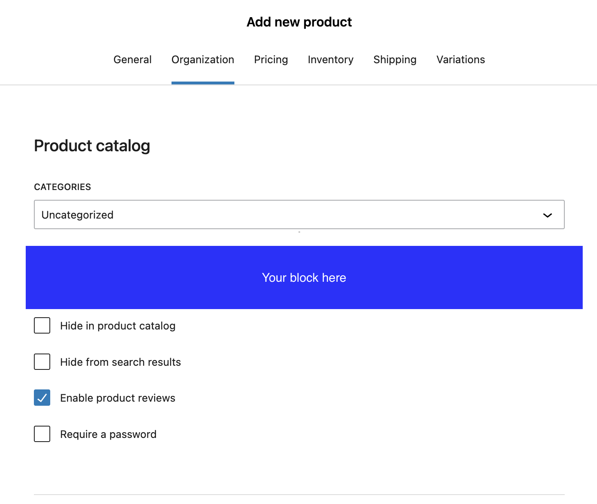

# Common tasks

## Adding a group/section/field next to an existing one

Here's a snippet that adds a new block to the catalog section for simple products, between the first and second fields (order 15):

```php
if ( ! function_exists( 'YOUR_PREFIX_on_block_template_register' ) ) {
	/**
	 * Add a new block to the template.
	 */
	function YOUR_PREFIX_on_block_template_register( BlockTemplateInterface $template ) {
		if ( $template instanceof ProductFormTemplateInterface && 'simple-product' === $template->get_id() ) {
			$section = $template->get_section_by_id( 'product-catalog-section' );
			if ( $section !== null ) {
				$section->add_block(
					[
						'id'         => 'your-prefix-id',
						'blockName'  => 'your-block-name',
						'order'      => 15,
						'attributes' => [
							'key'   => 'value',
						],
					]
				);
			}
		}
	}
	add_action( 'woocommerce_block_template_register', 'YOUR_PREFIX_on_block_template_register' );
```
Result:


## Hiding a group/section/field

## Reordering groups/sections/fields
