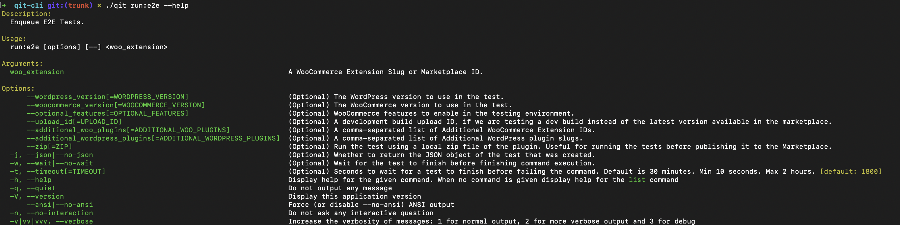

# Getting started

The QIT CLI is a command line interface tool that allows you to run automated tests in the cloud against extensions available in the WooCommerce Marketplace, powered by the Quality Insights Toolkit test runner.

## Requirements

- PHP 7.2.5 or higher
- Unix environment (Linux, macOS, Windows WSL)
- Composer

## Installing QIT

You can install QIT in three different ways:

### Per Project

1. Run `composer require woocommerce/qit-cli --dev`
2. Execute `./vendor/bin/qit` to authenticate with your WooCommerce.com Partner Developer account.

### Globally Using Composer

1. Run `composer global require woocommerce/qit-cli`
2. Execute `qit` to authenticate with your WooCommerce.com Partner Developer account. Ensure that the Composer bin folder is in your PATH. [Example](https://stackoverflow.com/a/64545124).

### Globally Using `wget`

(Pro Tip: Opting for the Composer installation method simplifies the process of updating QIT in the future 😉)

1. Run `wget https://github.com/woocommerce/qit-cli/raw/trunk/qit`
2. Execute `chmod +x qit`
3. Move the file to a directory in your PATH, such as `sudo mv qit /usr/local/bin/qit`
4. Run `qit` to authenticate with your WooCommerce.com Partner Developer account.

## Updating QIT

Updating QIT will depend on how you installed it.

### If you installed it per-project

1. Run `composer update woocommerce/qit-cli`

### If you installed it globally using Composer

1. Go to your global composer directory `cd $(composer global config bin-dir --absolute)`
2. Run `composer update woocommerce/qit-cli`

#### If you installed it with `wget`

1. Delete the old binary `which qit` then `rm` it.
2. Repeat the installation steps.
