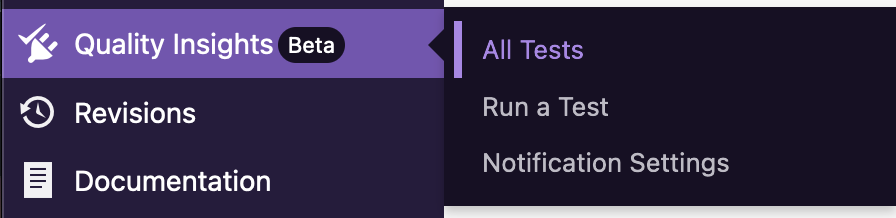
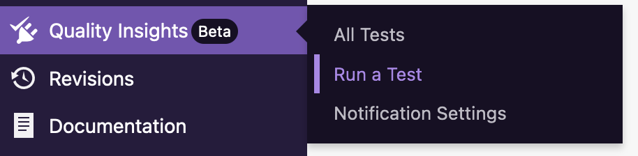
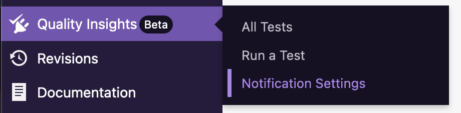

# Getting started

The QIT Dashboard is a tool available to extension developers in the WooCommerce administrative interface. This tool allows developers to run a variety of tests with their extension installed in a test environment, configured with the latest version of WordPress and either the release candidate or latest version of WooCommerce. If you have multiple extensions, you can select the extension you’d like to run the tests against.

To get started, you'll need to log in to your account on WooCommerce.com. Once you log in to your account, click on "Vendor Dashboard" to go to your dashboard:

In the menu on the left-hand side, you'll see a new `Quality Insights` menu item:

Hovering over the menu will give you the three sections that make up the QIT Dashboard:

- All Tests
- Create a Test
- Notification Settings

More details on each of these options is provided below.

## All tests

The All Test page gives you insight into the extension the tests were ran against, the version of the extension, and what test type was ran. In addition, you can see what the results of the test runs were (such as failed, success, or pending if they’re currently running) and, in the case of end-to-end tests, view the Allure test report if the tests fail.

For more insight into the test results, please see [Viewing test results](viewing-test-results.md).

## Run a test

On this page, you can select [the type of test](../test-types) you'd like to run, which extension to test, and choose the versions of WooCommerce and WordPress to run the tests against.

For more details around creating a test, please see [Run a test](run-a-test.md).

## Notification settings

If any of the tests result in a failed test result, we will send out an email that contains details on the test type that failed and the versions of the extension, WooCommerce, and WordPress that the test failed for. Email notifications can be enabled or disabled for each test type. By default, emails will be sent to your account email address.

For more information around configuring notifications, see [Configure notifications](notifications.md).
