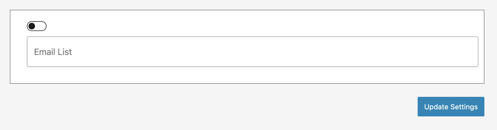
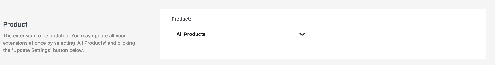
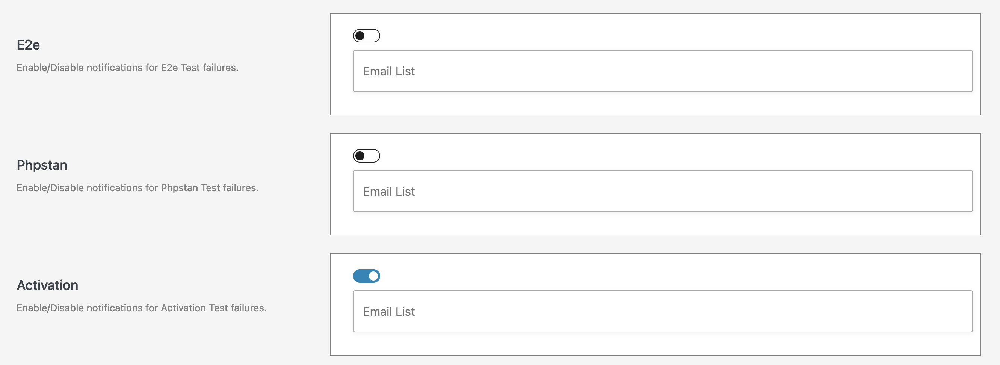
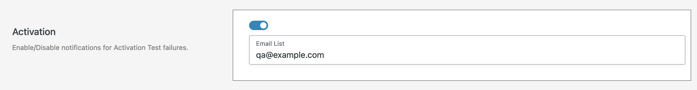

# Configure notifications

To update the way notifications are sent for failed tests, navigate to the `Notification Settings` page under the `Quality Insights` menu:

After making changes, click the `Update Settings` button at the bottom of the page:

## Notifications by product

Notifications can be enabled and disabled both on a per-product basis as well as for all products that you sell in the store. To update these settings, select the specific product or select `All Products` to update notification settings for all of your products at once:

## Notifications by test type

You can enable and disable notifications for each [test type](../test-types.md) that is available by clicking on the toggle:

## Customize email recipients

By default we'll send test result emails to your account email address. If you'd like to override and send these emails to other recipients, please add an optional comma-separated list of email addresses to send the tests results to.

