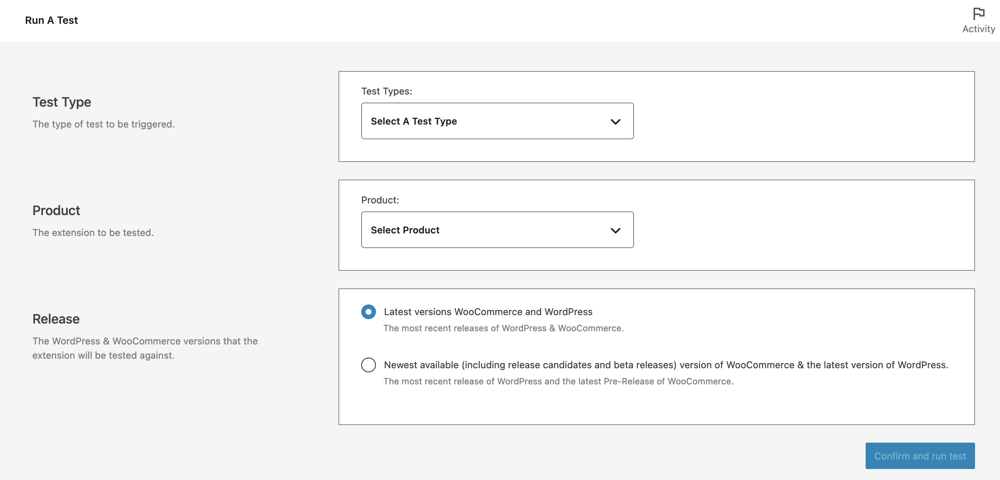
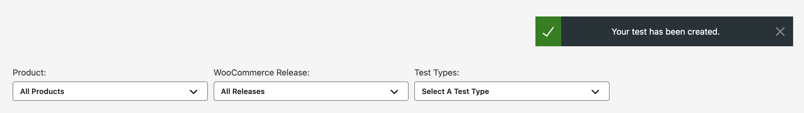
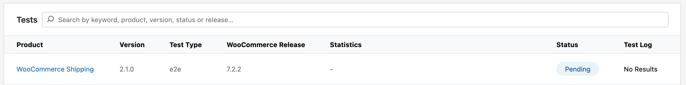
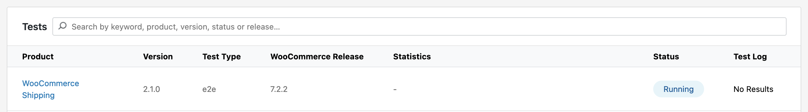

# Run a test

To start a new test, navigate to the `Run a Test` page under the `Quality Insights` menu:

On this page, you can configure the type of test to run, the product to run the tests against, and which release version:

Once you've selected the type of test you'd like to run, the product to run it against, and the release version, click the `Confirm and run test` button at the bottom to queue up the test to be ran:

Once the test has been queued up, you'll be redirected to the All Tests page and will see a success notification that the test has been created:

!> Note that it may take a moment before the test shows in the table. You can refresh the page or wait for the table to automatically refresh.

The test will then be displayed in the table, showing the version of the extension, the selected test type, the selected WooCommerce Release version with a `Pending` status:

Once the test has been picked up and the tests are running, the status will change to `Running`:

---

More details on each the options available on the `Create a Test` page can be found below:

## Test type

Select the [type of test](test-types.md) you'd like to run. The current options are available:

- End-to-end
- API
- Activation
- Security
- PHPStan

## Product

Select the product you'd like to run the tests against. All products that you have submitted and are available on the WooCommerce Store will be listed in the dropdown.

## Release

Select the release versions of WooCommerce and WordPress you'd like to execute the tests against. Currently there are two options available:

- The most recent releases of WordPress and WooCommerce.
- The most recent release of WordPress and the latest release candidate version of WooCommerce.
