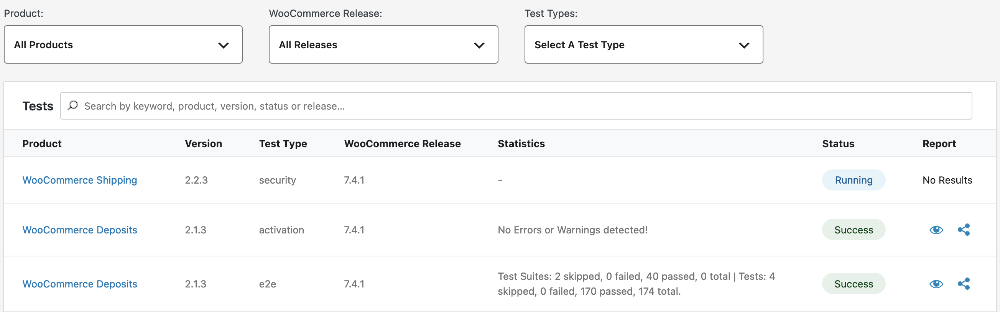
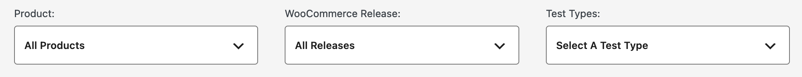
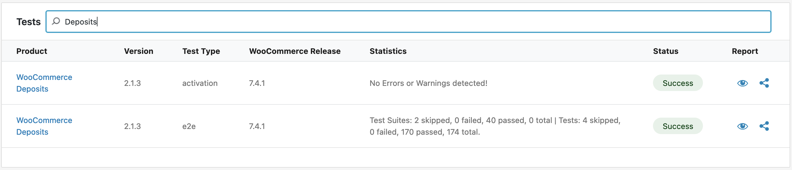
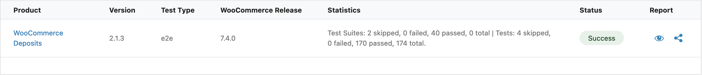
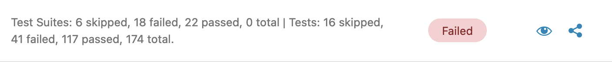
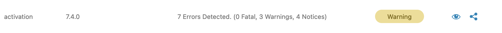
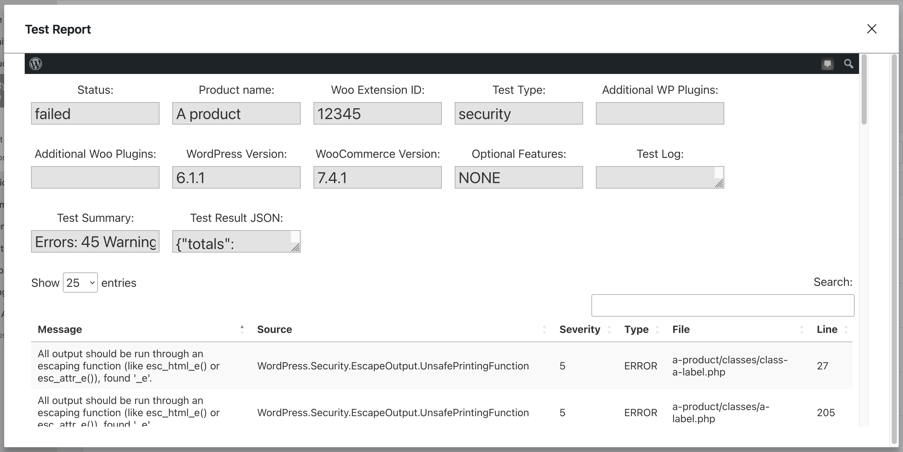
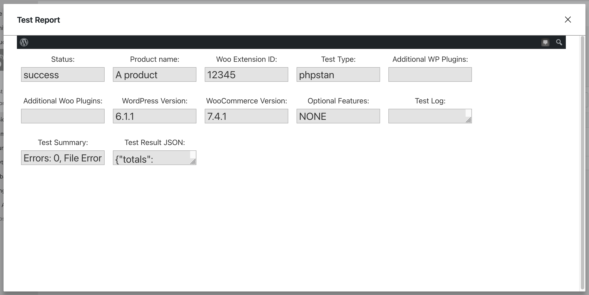

# Viewing test results

To view the tests that were created and their results, navigate to the `All Tests` page under the `Quality Insights` menu:

In the table on this page, all of the tests that you created will be shown in the list, starting with the most recent:

## Filtering results

You can filter the test results shown in the table by selecting one of the three available filters at the top of the page:

- Product: Filter by the product the tests were ran against.
- WooCommerce Release: Filter by the WooCommerce release version the tests were ran against.
- Test Types: Filter by the test type that was ran, such as e2e or activation.

You can also search the tests by providing keywords such as the product, the version, the test type, status or release:

## Viewing test logs

After a test run completes, you'll be able to view a variety of reports depending on the test type, and you can also share the link to the test results:

>  Click this icon to view the test results report.

>  Click this icon to copy a link to the test results to your clipboard to share with others.

### End-to-end tests

#### Successful runs

When an end-to-end test passes, you'll be able to view the report and see the tests that were ran by clicking on the view icon:

This will open a modal that you can scroll through and see the results of each test that was ran:

#### Failed test runs

If an end-to-end test run fails, an Allure test report will be generated. Click on the view icon to see the full details of the Allure test report:

### Security, Activation, and PHPStan tests

To view the test logs for these test types, click on view icon in the table for the extension test results you'd like to view:

This will open a modal where you can view the test results. For example, a failed Security test would show the following in the modal:

You'll also be able to view a log and share the result for successful tests as well:

