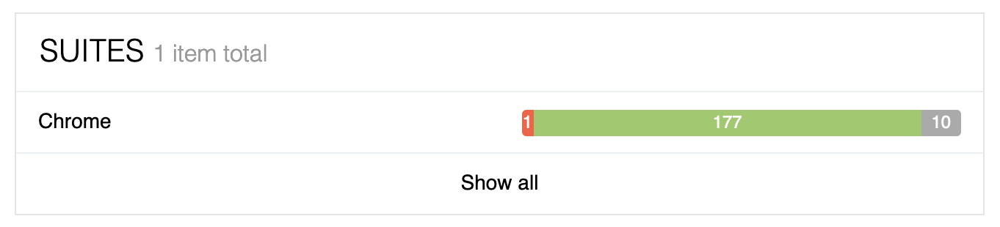
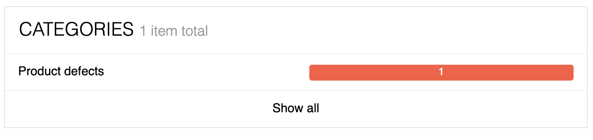
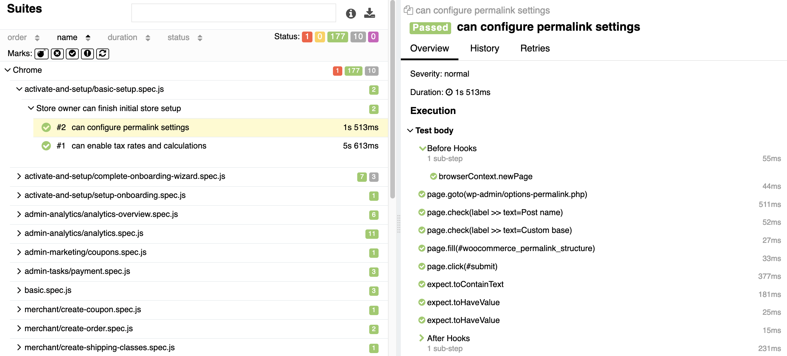
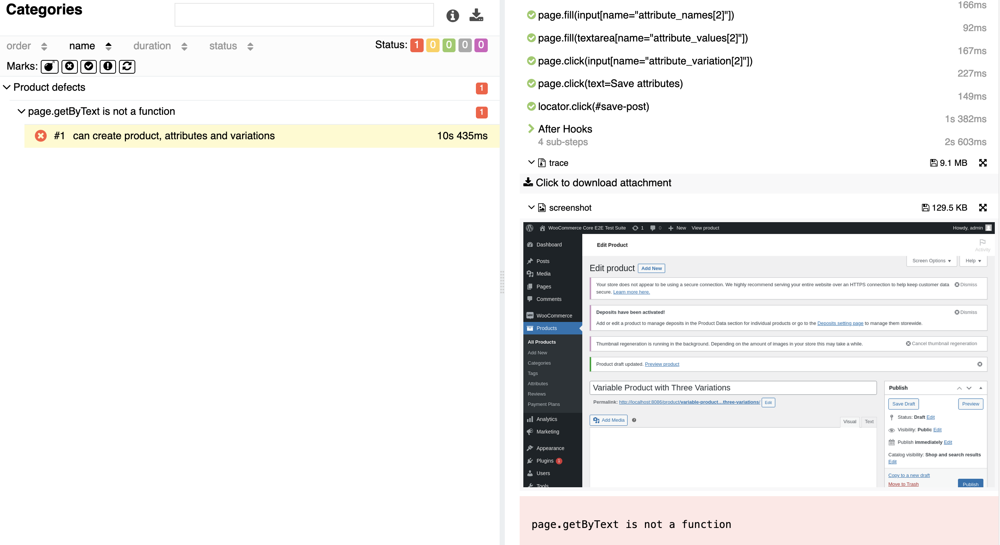

# Test Types

QIT supports the following test types:

- [End-to-end](#end-to-end-tests)
- [API](#api-tests)
- [Activation](#activation-tests)
- [Security](#security-tests-beta)
- [PHPStan](#phpstan-tests)

## End-to-End Tests

The end-to-end (e2e) test creates a temporary WordPress installation with WooCommerce and the extension under test installed, and uses a browser that is scripted to perform certain automated tasks, such as completing the WooCommerce onboarding wizard, creating a product, making a purchase as a customer, verifying the order details as an admin, tweaking tax settings, etc.

Then, it runs the [WooCommerce Core end-to-end tests](https://github.com/woocommerce/woocommerce/tree/trunk/plugins/woocommerce/tests/e2e-pw) against a store with your extension activated. These tests cover the [WooCommerce Core Critical Flows](https://github.com/woocommerce/woocommerce/wiki/Critical-Flows) to verify that a given extension does not break the default WooCommerce behaviors. Once the tests complete, the dashboard will show a Success or Failure test result. In the case of a failed test, a link to an Allure test report will be provided that allows you to dig into the details and see what failed and why.

> Currently, QIT can only run the WooCommerce Core E2E test suite. Future support for running your own E2E tests is planned.

### Example

This GIF is an example of the end-to-end test running. It performs a series of automated actions in a browser, such as creating a product, making a purchase, and verifying the order details as an admin, as fast as possible. The test is run against a store with the extension under test activated.

<details>
<summary>Click to view GIF</summary>

</details>

### What to do if it fails

If your end-to-end test is failing, please take the following steps:

- Check the Allure test report to see what failed and why. If you're unable to reproduce the issue manually, try re-running the test to see if it passes.
- If the test continues to fail, it can be either because of a bug that should be fixed, or because your extension modifies the default WooCommerce behavior in a way that is unexpected by the automated tests.
- We expect a certain amount of extensions to fail the end-to-end tests because they modify WooCommerce behaviors in ways that the tests are not designed to account for, such as modifying HTML selectors, etc. If you believe that is the case with your extension, please email us at qit@woocommerce.com and we can help you determine the best way to proceed, by either adapting the tests, suggesting some tweaks to your plugin, or by ignoring some tests specifically for your plugin.

### Understanding Allure Reports

For end-to-end test failures, an Allure test report will be generated and is available on the [All Test page](../dashboard/viewing-test-results.md). Allure reports provide a lot of great information to help troubleshoot and diagnose any test failures. For failures, screenshots and a stacktrace is provided. This section provides an overview of a report and where to go to view results. For a more detailed overview, see the official Allure documentation under [Report Structure](https://docs.qameta.io/allure-report/#_report_structure).

### Viewing a report

An Allure report is generated for end-to-end test failures and can be viewed by clicking the `View Report` button on the `Quality Insights > All Tests` page in the QIT Dashboard:

Following this link will open the Allure test results in a modal:


The `Suites` section shows what browser the tests were ran on, and the results of the tests (currently the tests are only ran in Chrome):



This page will provide a quick view into what percentage of tests passed, failed, or were skipped. Any failures will be reported in the `Categories` section under `Product defects`:



### Digging into the details

#### Successful results

For successful tests, you can view the details by going into the `Suites` section, either from the `Overview` page or by clicking the `Suites` menu option on the left-hand side. There, you can click into individual tests that passed and view the steps that were taken, the HTML selectors that were used, and what assertions were made:



#### Failed cases

When tests fail, Allure will provide the stack trace, the error that it encountered, and a screenshot of where it failed:



This allows you to dig through the steps that were taken by the test, download the stack trace, and see if it's possible to replicate the issue for any potential bugs that may need to be addressed.

!> We've done our best to stamp out as much flakiness as possible in our end-to-end tests, but it can still occur. If you're unable to reproduce the issue manually, try re-running the test to see if it passes.

## API Tests

API Testing is a crucial part of ensuring the smooth functioning of an application. With API testing, we execute a set of operations using the [WooCommerce REST API](https://woocommerce.github.io/woocommerce-rest-api-docs/) and verify that the API responds in an expected, consistent, way. These operations include creating products, customers, and orders through the REST API and then validating the data that we have created.

The test suite that we use for this process is the [WooCommerce Core API tests](https://github.com/woocommerce/woocommerce/tree/trunk/plugins/woocommerce/tests/api-core-tests). These tests are ran against a store where your extension has been installed and activated. Upon completion of the test, you can check the results either in the Dashboard, or retrieving the test using the QIT CLI, to see if the test has passed or failed. If it fails, you can access an Allure test report that will provide you with a detailed analysis of the reasons for the failure.

### What to do if it fails

In the event of a failed API test, you must take the following steps:

- Review the test report.
- Analyze the causes of the failure and attempt to recreate the issue on your local setup.
- Resolve the issue and run the test again.
- If you believe that the result is incorrect, please do not hesitate to contact us at qit@woocommerce.com.

## Activation tests

The Activation test type activates your extension against a freshly created shop and captures any PHP errors or warnings that may occur on activation. This test sets up a WooCommerce store using the provided WordPress and WooCommerce versions. The following statuses will be returned from this test:

- Success: No PHP notices, warnings, or errors were triggered.
- Warning: A non-fatal PHP error was triggered.
- Failure: A fatal PHP error was triggered.

### What to do if it fails

If your activation test is failing, please take the following steps:

- Open the test report
- Identify the causes of failure. The test will log PHP notices, warnings, and errors that happens when activating your plugin
- Try to reproduce it locally and fix the issue
- If you think the result is incorrect, please email us at qit@woocommerce.com

## Security Tests (Beta)

This test runs an experimental security scanner against a given extension.

- Success: No security issues errors or warnings.
- Warning: Only security issues warnings.
- Failure: One or more security issues errors.

### What Tools Are Used?

The tools used in the Security Scanner are, currently, [PHPCS](https://github.com/squizlabs/PHP_CodeSniffer) and [SemGrep](https://semgrep.dev/).

### Can I run it Locally?

Ideally, you should delegate all the testing execution to QIT. We don't support running the tests outside of QIT, but you can mimick at least the PHPCS rules. The SemGrep rules are not available to be run locally.

### Which PHPCS Rules Are Enabled?

Currently, the only rules enabled in the Security Scanner is `WordPress.Security.EscapeOutput`, and `WordPress.Security.ValidatedSanitizedInput`, with some custom sanitizing and escaping functions whitelisted.

These two rules were chosen as a basic level of security to enforce on all extensions, as they are very accurate and will hardly flag false positives. In the near future, we plan to allow the developer to opt-in to stricter levels of security scans, to show off the good work they do, such as nonce checks, or other security programs, such as generational AI-based scanners that can understand flow of logic, or other third party software other than PHPCS and SemGrep. If you'd like to be a part of the process to define the rules ran against your extensions, feel free to [contact us](https://woocommerce.github.io/qit-documentation/#/contact-us) with your suggestions.

For a more detailed look on our PHPCS rulesets, please see the sample below.

```xml
<?xml version="1.0"?>
<ruleset name="Woo Marketplace PHPCS Security Checks">
    <description>Woo Marketplace PHPCS Security Checks.</description>

    <arg value="sp"/>
    <arg name="colors"/>
    <arg name="extensions" value="php"/>
    <arg name="parallel" value="8"/>

    <exclude-pattern>tests/*</exclude-pattern>
    <exclude-pattern>vendor/*</exclude-pattern>
    <exclude-pattern>vendor-prefixed/*</exclude-pattern>


    <rule ref="WordPress.Security.EscapeOutput">
        <properties>
            <property name="customEscapingFunctions" type="array" value="WC_Payments_Utils,esc_interpolated_html,wc_help_tip,wc_sanitize_tooltip,wc_selected,wc_kses_notice,wc_esc_json,wc_query_string_form_fields,wc_make_phone_clickable" />
        </properties>
    </rule>

    <!-- Lack of nonces will be added at a later point to minimize noise. -->
    <rule ref="WordPress.Security.NonceVerification">
    	<severity>0</severity>
	</rule>

	<!-- Do not flag missing "wp_unslash()" calls to globals such as $_POST, and $_GET, etc. -->
    <rule ref="WordPress.Security.ValidatedSanitizedInput.MissingUnslash">
    	<severity>0</severity>
	</rule>

	<!-- Do not flag missing checks of "isset" on $_POST, $_GET, etc. -->
    <rule ref="WordPress.Security.ValidatedSanitizedInput.InputNotValidated">
    	<severity>0</severity>
	</rule>

	<!-- Do not flag usage of deprecated "// WPCS: XSS ok." -->
    <rule ref="WordPress.Security.EscapeOutput.DeprecatedWhitelistCommentFound">
    	<severity>0</severity>
	</rule>

    <!-- Warn about usage of potentially dangerous functions. -->
    <rule ref="Generic.PHP.ForbiddenFunctions">
      <properties>
        <property name="error" value="false" />
        <property name="forbiddenFunctions" type="array" value="wp_set_auth_cookie=>null,wp_set_current_user=>null"/>
      </properties>
    </rule>

    <rule ref="WordPress.Security.PluginMenuSlug"/>

	<!-- When we disable "InputNotValidated", "InputNotSanitized" also gets disabled, and this is not what we want. -->
    <rule ref="WordPress.Security.ValidatedSanitizedInput.InputNotSanitized">
    	<severity>5</severity>
	</rule>

	<rule ref="WordPress.Security.ValidatedSanitizedInput">
		<properties>
			<property name="customSanitizingFunctions" type="array" value="wc_booking_sanitize_time,wc_clean,wc_sanitize_tooltip,wc_format_decimal,wc_stock_amount,wc_sanitize_permalink,wc_sanitize_textarea" />
			<property name="customUnslashingSanitizingFunctions" type="array" value="stripslashes"/>
		</properties>
	</rule>
</ruleset>
```

### What to do When Encountering a Discouraged Function?

We identify functions that may lead to potential security vulnerabilities and mark them with a Warning using the `Generic.PHP.ForbiddenFunctions.Discouraged` rule.

While these functions are not inherently unsafe, they frequently contribute to critical vulnerabilities. We flag them to encourage you to review the code for security. If you've confirmed that the code is secure, you can suppress the warning by adding the following comment on the same line as the function: `// phpcs:ignore Generic.PHP.ForbiddenFunctions.Discouraged`

### What to do if it Fails

If your security test is failing, please take the following steps:

- Open the test report
- Identify the causes of failure. The test will log any security issues that our scanner identifies
- Fix the issue and re-run the test

### Handling False Positives

False positives, or alerts for security issues that do not exist in actuality, may occasionally arise during security testing. Though we've chosen PHPCS and SemGrep rules to minimize such occurrences, it's important to address these false positives in a systematic way.

- **Verification:** The first step is to understand and confirm if it's indeed a false positive. Review the flagged code section and the warning or error raised by the tool. It's always good to revisit the code and the associated rule to understand the potential security implications, if any.
- **Report:** If after careful review, the flag still appears to be a false positive, report it to us. Send an email to qit@woocommerce.com explaining the situation, with the specific test result and the corresponding part of your code. Please make sure to include any additional information that can help us understand why you believe it's a false positive.
- **Suppression (temporarily):** In the meantime, while we investigate the issue, you might want to suppress the false positive to continue your work without disruption. To do so, add a comment line right before the flagged line in your code.
    - For PHPCS errors, add `// phpcs:ignore Rule.Name` on the line where the error is reported. Replace `Rule.Name` with the rule that has caused the false positive, eg: `// phpcs:ignore WordPress.Security.ValidatedSanitizedInput`
    - For SemGrep errors, add `// nosemgrep: rule-id` in a similar manner, replacing rule-id with the SemGrep rule identifier, eg: `// nosemgrep: audit.php.wp.security.xss.query-arg`

Only suppress the error if you are certain that it is a false positive.

- **Resolution:** We'll review your report and communicate our findings. If we confirm it's a false positive, we will work towards fine-tuning our rules to prevent such instances in the future. Your cooperation in reporting these instances is invaluable to improve the quality and accuracy of our security testing.

Please note, suppressing warnings or errors should be done judiciously and is only recommended as a temporary solution. We strongly advise against using it as a permanent solution to avoid security tests. Our goal is to ensure that your extensions are as secure as possible, and ignoring genuine warnings or errors can lead to security vulnerabilities.

## PHPStan tests

The PHPStan test type runs level 0 PHPStan checks against your extension. More details on what the rule levels cover can be found in the official PHPStan documentation: [Rule Levels](https://phpstan.org/user-guide/rule-levels).

### What to do if it fails

Due to the very nature of WordPress and WooCommerce of not being typed codebases, static code analysis such as PHPStan have a high failure rate when testing WordPress plugins in general.

This doesn't mean that there are issues with the quality of the code, it's only that the code is not friendly to static code analysis, such as code with extensive usage of getters and setters, which is very common when integrating with WooCommerce Core.

The PHPStan tests still provide a lot of value for the developers that want to pursue the highest levels of quality. By default, we run PHPStan tests with level 0.

If your PHPStan test is failing, please take the following steps:

- You can ignore this test, as we don't use it internally to measure an extensions quality
- But if you wish to address the feedback that the static code analsysis provide, open the test report
- Identify the causes of failure
- Fix the issue and re-run the test
- If you think the result is incorrect, please email us at qit@woocommerce.com
