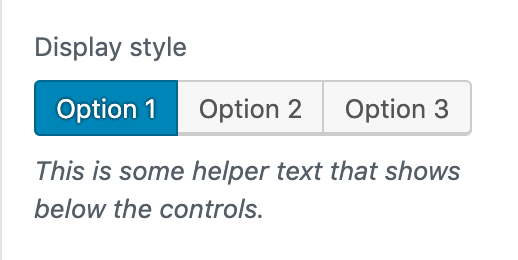

# ToggleButtonControl

ToggleButtonControl is used to generate a series of toggle buttons where only one selection is possible. It uses a ButtonGroup component to output each toggle button.



## Usage

Render a user interface to select multiple users from a list.

```jsx
  <ToggleButtonControl
    label={ __( 'Display style', 'woo-gutenberg-products-block' ) }
    value={ isDropdown ? 'dropdown' : 'list' }
    help="This is some helper text that shows below the controls."
    options={ [
      { label: __( 'List', 'woo-gutenberg-products-block' ), value: 'list' },
      { label: __( 'Dropdown', 'woo-gutenberg-products-block' ), value: 'dropdown' },
    ] }
    onChange={ ( value ) => setAttributes( { isDropdown: 'dropdown' === value } ) }
  />
) );
```

## Props

The component accepts the following props:

### label

If this property is added, a label will be generated using label property as the content.

- Type: `String`
- Required: No

### help

If this property is added, a help text will be generated using help property as the content.

- Type: `String|WPElement`
- Required: No

### value

If value is passed, one of the options will have pressed state.
If no value is passed no button will have pressed state.

- Type: `String`
- Required: No

### onChange

A function that receives the selected value (string) as input.

- Type: `function`
- Required: Yes

### className

The class that will be added with `components-base-control` and `components-toggle-button-control` to the classes of the wrapper div. If no className is passed only `components-base-control` and `components-toggle-button-control` are used.

Type: String
Required: No

#### options

An array of objects containing the following properties:
- `label`: (string) The label to be shown to the user.
- `value`: (Object) The internal value used to choose the selected value. This is also the value passed to onChange when the option is selected.

Type: `Array`
Required: No
