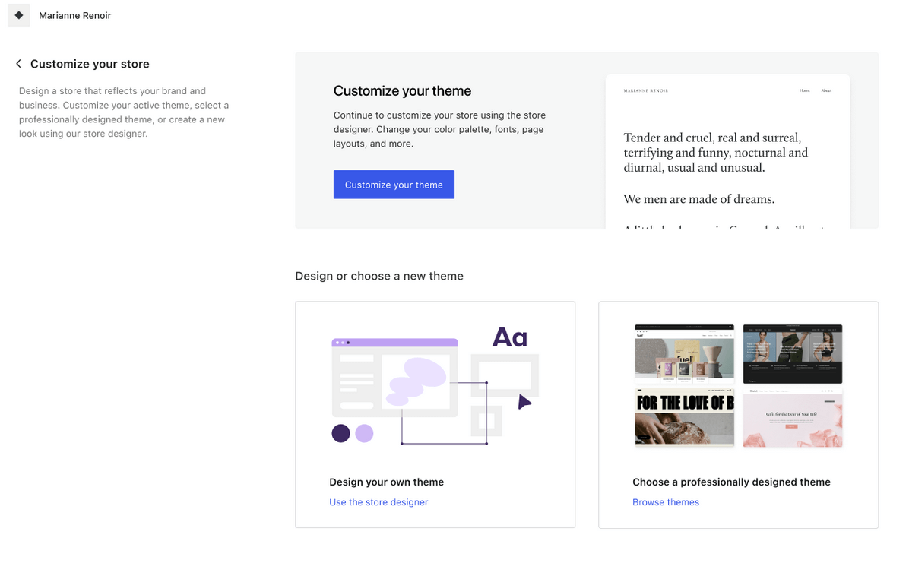
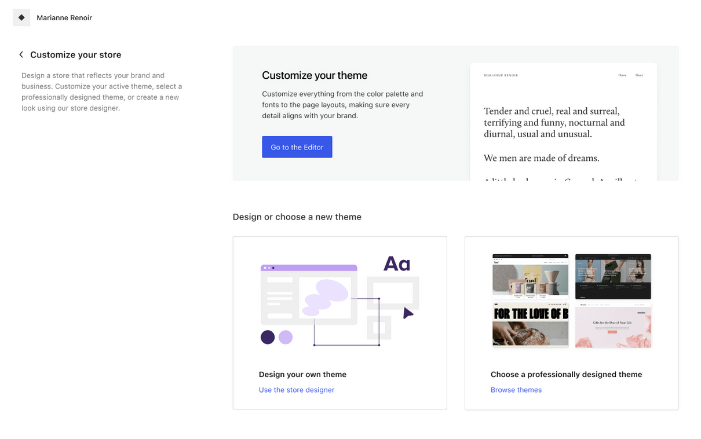
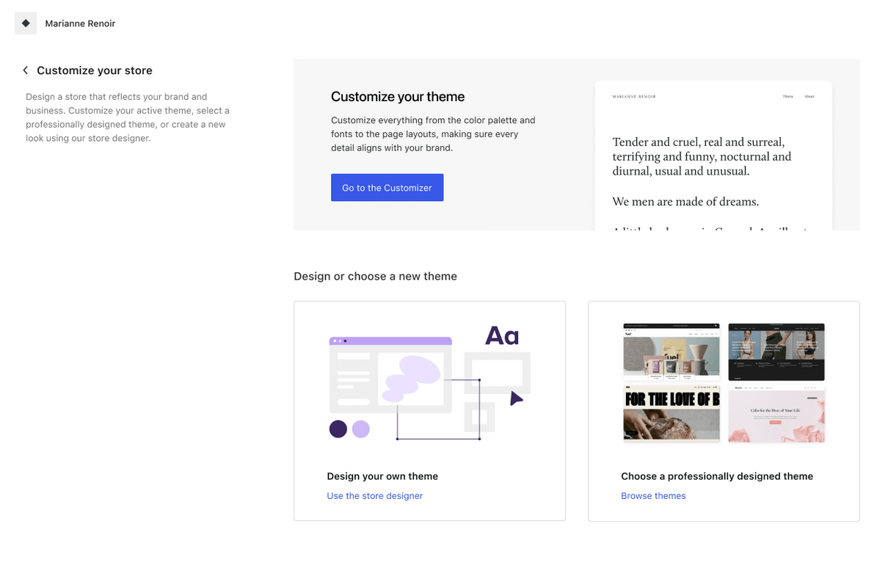
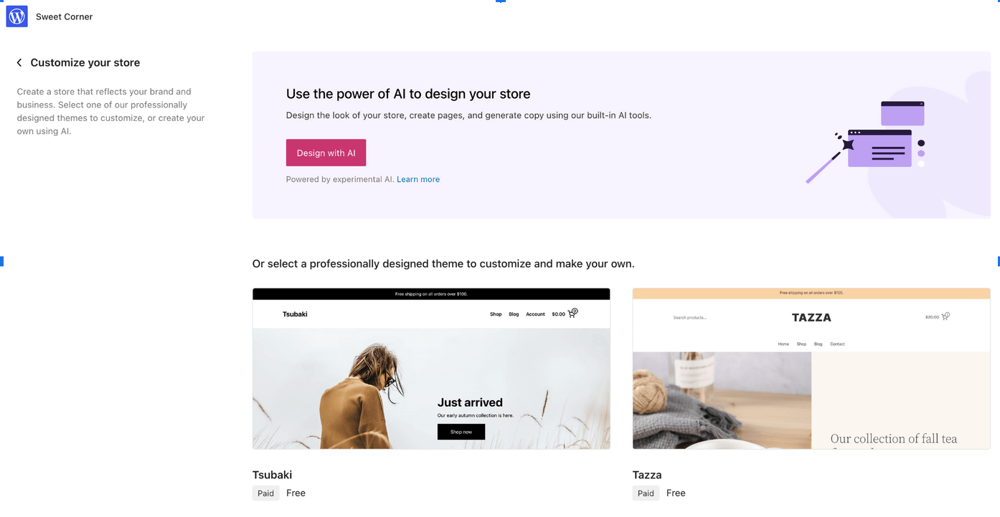
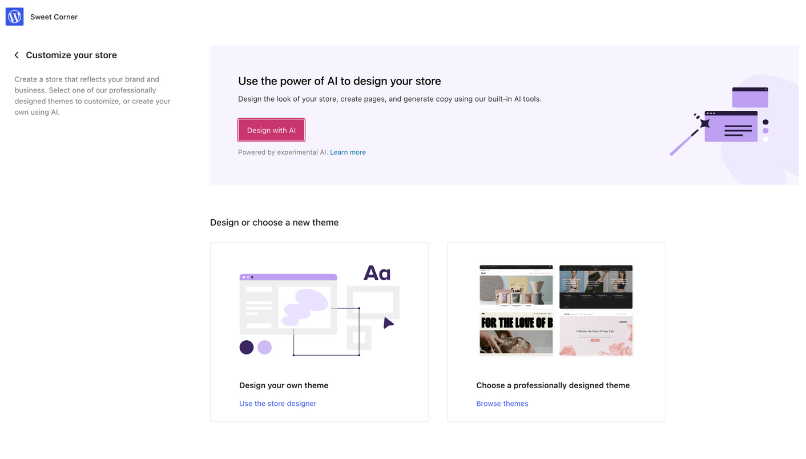
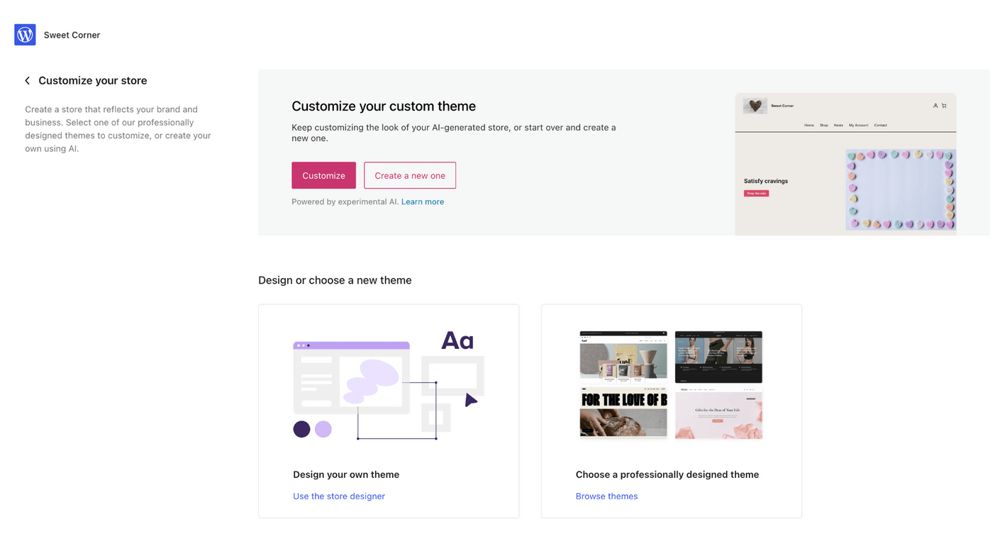
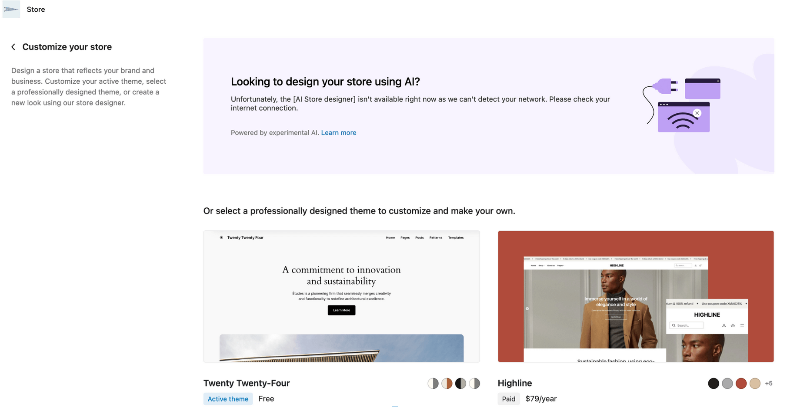

# Intro page

The logic for the Intro page is complex, and it varies based on multiple factors like:

- The active theme
- The status of the `Customize your store` tasks (completed or not)
- The flow type (AI flow or not)

## Core flow (no AI)

| Theme   | Task completed | Intro page                                                                                                                                                                                                                                   |
|---------|----------------|----------------------------------------------------------------------------------------------------------------------------------------------------------------------------------------------------------------------------------------------|
| TT4     | No             |                                                                                                                                                                                                                 |
| TT4     | Yes            | The "Customize your theme" and "Use the store designer" buttons go to the assembler.                                                                                                                           |
| Block   | -              | The "Go to the Editor" button opens the Editor (wp-admin/site-editor.php). "Use the store designer" opens a modal to inform the user their theme will change if they accept and it will start the CYS flow.      |
| Classic | -              | The "Go to the Customizer" button opens the Customizer (wp-admin/customize.php). "Use the store designer" opens a modal to inform the user their theme will change if they accept and it will start the flow.  |

## AI flow

| AI generated theme | Task completed | Intro page                                                                                                   |
|--------------------|----------------|--------------------------------------------------------------------------------------------------------------|
| -                  | No             |                                                                           |
| No                 | Yes            | The "Use the store designer" button shows a modal to warn about a theme switch.   |
| Yes                | Yes            | The "Use the store designer" button shows a modal to warn about a theme switch.  |

## Other

### Network offline

