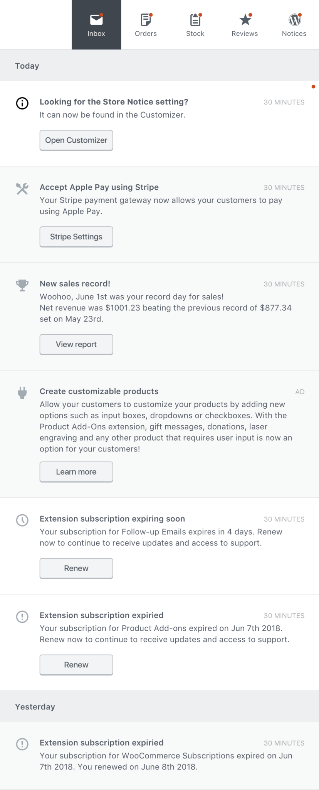

# Activity Panel Inbox

Right now, installing and activating WooCommerce and a few extensions quickly results in a cascade of notices vying for the store administrator’s attention (and pushing whatever wp-admin content they were trying to get to on a page down, way down.)

As part of the Dashboard and Analytics improvements coming to WooCommerce, we’re going to do something a bit dramatic to try and clean up this notice-palooza.

First, we’re splitting up notices into two broad categories.

## Category 1: Store Alerts

The first category is what we’re calling “Store Alerts” - similar to the notices you have today, these notices are present at the top of administration pages and will look something like this:


But unlike today’s notices, this part of the UI will be reserved for “priority” messages to the administrator - things like version and security updates and critical errors.  What sort of errors are “critical errors”? Well, things like a payment gateway that has stopped working because its connection is down, or when the store is set for physical product support but no shipping methods are defined.

## Category 2: Activity Panel Inbox

The second category is what we’re focusing on in this example - and what we expect the vast majority of extension developers will want to extend - we call it the “Activity Panel Inbox.” It will look something like this:



This section is dedicated to informational content coming from multiple sources such as WooCommerce core, Woo.com Subscription management, extensions activity and store achievements. This section was also envisioned to display more insightful content in the future, e.g. content that could help with the day to day tasks of managing and optimizing a store.

Each notice or “note” has a type represented by an icon (Gridicon), a title, content, a timestamp and one or two actions (action title + link).

### Inbox Design Constraints and Best Practices

Extensions can add their own notes via the data stores we’ll be covering below, but first: some constraints.

There are some constraints extensions should follow when working with the inbox:

1. Generally speaking, don’t change the order of items. It is OK for an extension to occasionally “bump” a note to the top of the inbox by deleting a note and adding a new note with similar content, but bumping should be done sparingly. For example, subscription notes will be bumped at 45, 20, 7, and 1 days before the corresponding subscription expires.
1. Generally speaking, don’t delete notes. There are a few situations where deleting notes makes sense, like after the user has corrected a bad connection, but again, generally, don’t delete notes.
1. That said, it is OK to change note content. This can be useful after the user has taken an action (e.g. renewed an expiring subscription). Changing the message after they do something like that makes it easy for the user to see a chronology of things they’ve done.
1. Don’t add UI components. Focus on the PHP API.
1. Be aware that notes are stored in the database using the locale in effect when the note was added to the inbox. Also be aware that you can use content_data property of a note in a hook context to “re-localize” notes on the fly into new locales.
1. Feel free to use the content_data property to store other things too - it isn’t just limited to things needed for “re-localization” - and it is backed by a longtext column in the database.
1. Notes can have 0, 1, or 2 action buttons. Action buttons have URLs. They can either be complete URLs (like in the case of an external link) or partial URLs (like in the case of an admin page on the site) - in the case of partial URLs you’ll want to give a string that is the same as what you’d supply to WordPress core’s admin_url function. You can even include query parameters in that string.
1. You should store your extension’s name (slug) in the source property of the note. WooCommerce will store ‘woocommerce’ there. For example, the “Panda Payments” extension could use a name like “panda-payments” - this makes it easier to use built in functions to get (or delete) all notes with a certain name.
1. You can use the name property of a note to store a sub-type of note. For example, if the Panda Payments extension generates notes for both connection problems AND for new features, they might both have ‘panda-payments’ in the source property but then use ‘connection-problem’ and ‘new-feature’ in the name property to distinguish between the two types of notes.
1. Icons are Gridicons. You can find a gallery [here](https://automattic.github.io/gridicons/)
1. As a best practice, have your extension remove its notes on deactivation or at least uninstall.

So, enough rules - let’s get into how to code this up. And surprise, no JavaScript is necessary - you can work with the inbox exclusively through PHP -- the inbox front-end is React based, sure, but it draws all its data from a couple of new database tables and the PHP based REST API (and that’s where you can work with notes).

### Adding and Removing Inbox Items

Here’s a short example plugin that adds a new activity panel inbox note on plugin activation, and removes it on deactivation:

```php
<?php
/**
 * Plugin Name: WooCommerce Activity Panel Inbox Example Plugin One
 * Plugin URI: woocommerce.com/
 * Description: An example plugin.
 * Author: Automattic
 * Author URI: woocommerce.com/
 * Text Domain: wapi-example-one
 * Version: 1.0.1
 */

use Automattic\WooCommerce\Admin\Notes\Notes as Notes;
use Automattic\WooCommerce\Admin\Notes\Note as Note;

class WooCommerce_Activity_Panel_Inbox_Example_Plugin_One {
	const NOTE_NAME = 'wapi-example-plugin-one';

	/**
	 * Adds a note to the merchant' inbox.
	 */
	public static function add_activity_panel_inbox_welcome_note() {
		if ( ! class_exists( 'Automattic\WooCommerce\Admin\Notes\Notes' ) ) {
			return;
		}

		if ( ! class_exists( 'WC_Data_Store' ) ) {
			return;
		}

		$data_store = WC_Data_Store::load( 'admin-note' );

		// First, see if we've already created this kind of note so we don't do it again.
		$note_ids = $data_store->get_notes_with_name( self::NOTE_NAME );
		foreach( (array) $note_ids as $note_id ) {
			$note         = Notes::get_note( $note_id );
			$content_data = $note->get_content_data();
 			if ( property_exists( $content_data, 'getting_started' ) ) {
				return;
			}
		}

		// Otherwise, add the note
		$activated_time = current_time( 'timestamp', 0 );
		$activated_time_formatted = date( 'F jS', $activated_time );
		$note = new Note();
		$note->set_title( __( 'Getting Started', 'wapi-example-plugin-one' ) );
		$note->set_content(
			sprintf(
				/* translators: a date, e.g. November 1st */
				__( 'Plugin activated on %s.', 'wapi-example-plugin-one' ),
				$activated_time_formatted
			)
		);
		$note->set_content_data( (object) array(
			'getting_started'     => true,
			'activated'           => $activated_time,
			'activated_formatted' => $activated_time_formatted,
		) );
		$note->set_type( Note::E_WC_ADMIN_NOTE_INFORMATIONAL );
		$note->set_name( self::NOTE_NAME );
		$note->set_source( 'wapi-example-plugin-one' );
		$note->set_layout('plain');
		$note->set_image('');
		// This example has two actions. A note can have 0 or 1 as well.
		$note->add_action(
			'settings',
			__( 'Open Settings', 'wapi-example-plugin-one' ),
			'?page=wc-settings&tab=general'
		);
		$note->add_action(
			'settings',
			__( 'Learn More', 'wapi-example-plugin-one' ),
			'https://github.com/woocommerce/woocommerce-admin/tree/main/docs'
		);
		$note->save();
	}

	/**
	 * Removes any notes this plugin created.
	 */
	public static function remove_activity_panel_inbox_notes() {
		if ( ! class_exists( 'Automattic\WooCommerce\Admin\Notes\Notes' ) ) {
			return;
		}

		Notes::delete_notes_with_name( self::NOTE_NAME );
	}
}

function wapi_example_one_activate() {
	WooCommerce_Activity_Panel_Inbox_Example_Plugin_One::add_activity_panel_inbox_welcome_note();
}
register_activation_hook( __FILE__, 'wapi_example_one_activate' );

function wapi_example_one_deactivate() {
	WooCommerce_Activity_Panel_Inbox_Example_Plugin_One::remove_activity_panel_inbox_notes();
}
register_deactivation_hook( __FILE__, 'wapi_example_one_deactivate' );

```

### Updating Inbox Items

Here’s a short example plugin that updates an activity panel inbox note:

```php
<?php
/**
 * Plugin Name: WooCommerce Activity Panel Inbox Example Plugin Two
 * Plugin URI: woocommerce.com/
 * Description: An example plugin.
 * Author: Automattic
 * Author URI: woocommerce.com/
 * Text Domain: wapi-example-plugin-two
 * Version: 1.0.0
 */
 
use Automattic\WooCommerce\Admin\Notes\Notes as Notes;
use Automattic\WooCommerce\Admin\Notes\Note as Note;

class WooCommerce_Activity_Panel_Inbox_Example_Plugin_Two {
	const NOTE_NAME = 'wapi-example-plugin-two';

	/**
	 * Adds a note to the merchant' inbox.
	 */
	public static function add_or_update_activity_panel_inbox_note() {
		if ( ! class_exists( 'Automattic\WooCommerce\Admin\Notes\Notes' ) ) {
			return;
		}

		if ( ! class_exists( 'WC_Data_Store' ) ) {
			return;
		}

		$data_store = WC_Data_Store::load( 'admin-note' );

		// First, see if we've already created our note so we don't do it again.
		$note_ids = $data_store->get_notes_with_name( self::NOTE_NAME );
		if ( empty( $note_ids ) ) {
			$note = new Note();
			$note->set_title( __( 'Domain Renewal Coming Up', 'wapi-example-plugin-two' ) );
		} else {
			$note = Notes::get_note( $note_ids[0] );
		}

		$expires_in_days = rand( 2, 365 );
		$note->set_content(
			sprintf(
				/* translators: a number of days, e.g. 100 */
				__( 'Your domain expires in %d days.', 'wapi-example-plugin-wto' ),
				$expires_in_days
			)
		);
		$note->set_content_data( (object) array(
			'expires_in_days'     => $expires_in_days,
		) );

		$note->set_type( Note::E_WC_ADMIN_NOTE_INFORMATIONAL );
		$note->set_name( self::NOTE_NAME );
		$note->set_layout('plain');
		$note->set_image('');
		$note->set_source( 'wapi-example-plugin-two' );
		// This example has no actions. A note can have 1 or 2 as well.
		$note->save();
	}

	/**
	 * Removes any notes this plugin created.
	 */
	public static function remove_activity_panel_inbox_notes() {
		if ( ! class_exists( 'Automattic\WooCommerce\Admin\Notes\Notes' ) ) {
			return;
		}

		Notes::delete_notes_with_name( self::NOTE_NAME );
	}
}

function admin_init() {
	WooCommerce_Activity_Panel_Inbox_Example_Plugin_Two::add_or_update_activity_panel_inbox_note();
}
add_action( 'admin_init', 'admin_init' );

function wapi_example_two_deactivate() {
	WooCommerce_Activity_Panel_Inbox_Example_Plugin_Two::remove_activity_panel_inbox_notes();
}
register_deactivation_hook( __FILE__, 'wapi_example_two_deactivate' );

```

#### Using the REST API

A limited set of note fields can be updated over the REST API: `status` and `date_reminder`.

## Questions?

This is just the tip of the iceberg for possibilities for your own extensions to WooCommerce. Check
out the new [sales record notes](https://github.com/woocommerce/woocommerce-admin/blob/main/includes/notes/class-wc-admin-notes-new-sales-record.php) and the [settings notes](https://github.com/woocommerce/woocommerce-admin/blob/main/includes/notes/class-wc-admin-notes-settings-notes.php) in the woocommerce-admin code itself for other examples of working with this fun new feature.
