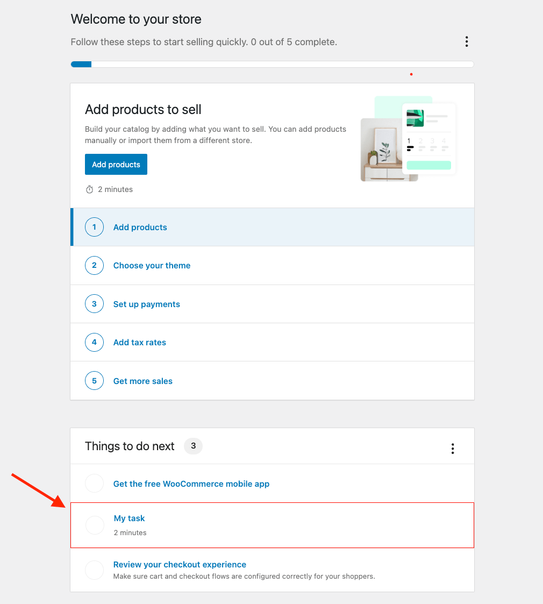

# WooCommerce Onboarding Tasks - Adding Custom Tasks Example

This example demonstrates how to add a custom task to the onboarding wizard.

Please refer to the [Onboarding Tasks documentation](../../../features/onboarding-tasks.md) for more information.

## Usage

Run the following command to build the example plugin:

```bash
WC_EXT=add-task pnpm --filter=@woocommerce/admin-library example
```

After running the command above and activating the plugin, you should see a new task in the onboarding wizard:




To watch for changes in the example plugin and rebuild it automatically, run the following command:

```bash
WC_EXT=add-task pnpm --filter=@woocommerce/admin-library example --watch
```