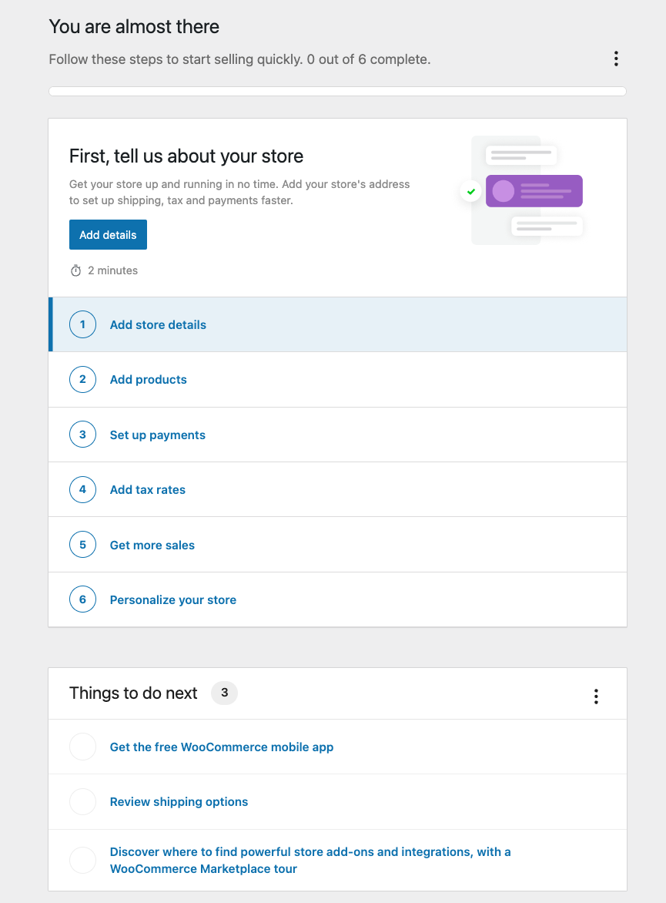

# WooCommerce Onboarding Tasks

The onboarding tasks provides a way to help store owners get their sites quickly set up.

The task list is easily extensible to allow inserting custom tasks around plugin setup that benefits store owners.

<!-- markdownlint-disable-next-line no-inline-html -->


## Adding a custom task

### Step 1: Add your task in PHP

To add a custom task, you first need to create a new class that extends the `Task` class.

```php
use Automattic\WooCommerce\Admin\Features\OnboardingTasks\Task;

class MyTask extends Task {
  public function get_id() {
    return 'my-task';
  }

  public function get_title() {
    return __( 'My task', 'woocommerce' );
  }

  public function get_content() {
    return __( 'Add your task description here for display in the task list.', 'woocommerce');
  }

  public function get_time() {
    return __( '2 minutes', 'woocommerce' );
  }
}
```

You can then add the task to the task list by calling the `add_task` method on the `TaskLists` class.

```php
use Automattic\WooCommerce\Admin\Features\OnboardingTasks\TaskLists;

TaskLists::add_task(
  'extended', // The task list ID. See the TaskList section below for more information.
  new MyTask(
    $task_lists::get_list( 'extended' ), // The task list object.
  )
);
```

### Step 2 – Register the task in JavaScript

Next, you have to add your task to the tasks list in JavaScript.

```jsx
/**
 * External dependencies
 */
import { createElement } from '@wordpress/element';
import {
	WooOnboardingTask,
	WooOnboardingTaskListItem,
} from '@woocommerce/onboarding';
import { registerPlugin } from '@wordpress/plugins';

const Task = ( { onComplete, task, query } ) => {
	// Implement your task UI/feature here.
	return <div></div>;
};

registerPlugin( 'add-task-content', {
	render: () => (
		<WooOnboardingTask id="my-task">
			{ ( { onComplete, query, task } ) => (
				<Task onComplete={ onComplete } task={ task } query={ query } />
			) }
		</WooOnboardingTask>
	),
} );

registerPlugin( 'add-task-list-item', {
	scope: 'woocommerce-tasks',
	render: () => (
		<WooOnboardingTaskListItem id="my-task">
			{ ( { defaultTaskItem: DefaultTaskItem } ) => (
				// Add a custom wrapper around the default task item.
				<div
					className="woocommerce-custom-tasklist-item"
					style={ {
						border: '1px solid red',
					} }
				>
					<DefaultTaskItem />
				</div>
			) }
		</WooOnboardingTaskListItem>
	),
} );
```

### Example

You can find a complete example of how to add a custom task as a WordPress plugin in the [examples directory](../examples/extensions/add-task/).

## Models and classes

### TaskLists

The `TaskLists` class serves as a data store for tasks, providing functionality to create, initialize, add tasks, retrieve task lists, and perform other task management operations.

#### Methods

- `TaskLists::instance()`: Returns the class instance of the `TaskLists` interface.
- `TaskLists::init()`: Initializes the task lists. This method should be called to set up the necessary configurations and hooks for task management.
- `TaskLists::is_experiment_treatment($name)`: Checks if an experiment is the treatment or control. This is internally used by Woo.
- `TaskLists::init_default_lists()`: Initializes the default task lists. This method adds predefined task lists with their properties and tasks.
- `TaskLists::init_tasks()`: Initializes the tasks. This method should be called to initialize the tasks associated with the task lists.
- `TaskLists::set_active_task()`: Temporarily stores the active task to persist across page loads when necessary. This method is used to manage active tasks.
- `TaskLists::add_list($args)`: Adds a task list with the specified properties.
- `TaskLists::add_task($list_id, $args)`: Adds a task to the specified task list.
- `TaskLists::maybe_add_extended_tasks($extended_tasks)`: Adds default extended task lists.
- `TaskLists::get_lists()`: Returns an array of all task lists.
- `TaskLists::get_lists_by_ids($ids)`: Returns an array of task lists filtered by the specified list IDs.
- `TaskLists::get_list_ids()`: Returns an array of all task list IDs.
- `TaskLists::clear_lists()`: Clears all task lists.
- `TaskLists::get_visible()`: Returns an array of visible task lists.
- `TaskLists::get_list($id)`: Retrieves a task list by its ID.
- `TaskLists::get_task($id, $task_list_id = null)`: Retrieves a single task.
- `TaskLists::setup_tasks_remaining()`: Return the number of setup tasks remaining.
- `TaskLists::menu_task_count()`: Adds a badge to the homescreen menu item for remaining tasks.
- `TaskLists::task_list_preloaded_settings($settings)`: Adds visible list IDs to component settings.

### TaskList

The `TaskList` class represents a task list. It contains properties and methods for managing task list. We currently have three predefined task lists

- `setup`: The default task list
- `extended`: The "Things to do next" task list
- `secret_tasklist`: The "Secret" task list that is used for having tasks that are accessed by other means.

#### Example & Arguments

```php
$args = array(
  'id'                      => 'my-list', // A unique task list ID.
  'title'                   => 'My List', // Task list title.
  'sort_by'                 => array( // An array of keys to sort the tasks by.
    array(
      'key'   => 'is_complete',
      'order' => 'asc',
    ),
    array(
      'key'   => 'level',
      'order' => 'asc',
    ),
  ),
  'tasks'                   => array( /* Array of Task objects */ ), // Optional: Initialize with pre-existing tasks.
  'display_progress_header' => true, // Optional: Whether to display the progress header. 
  'event_prefix'            => 'tasklist_', // Optional: Event prefix for task-related events.
  'options'                 => array(
    'use_completed_title' => true, // Optional: Whether to use a completed title for the task list.
  ),
  'visible'                 => true, // Optional: Whether the task list is visible.
);

$task_list = new TaskList($args);
```

#### Methods

- `$task_list::get_list_id()`: Returns the ID of the task list.
- `$task_list::get_title()`: Returns the title of the task list.
- `$task_list::get_tasks()`: Returns an array of tasks associated with the task list.
- `$task_list::add_task($task)`: Adds a task to the task list.
- `$task_list::remove_task($task_id)`: Removes a task from the task list based on its ID.
- `$task_list::get_task($task_id)`: Retrieves a task from the task list based on its ID.
- `$task_list::get_viewable_tasks()`: Returns an array of viewable tasks within the task list.
- `$task_list::is_visible()`: Checks if the task list is visible.
- `$task_list::is_hidden()`: Checks if the task list is hidden.
- `$task_list::is_complete()`: Checks if all tasks in the task list are complete.
- `$task_list::get_completed_count()`: Returns the count of completed tasks in the task list.
- `$task_list::get_total_count()`: Returns the total count of tasks in the task list.
- `$task_list::get_progress_percentage()`: Returns the progress percentage of the task list.
- `$task_list::get_sorted_tasks($sort_by)`: Returns the tasks sorted based on the specified sorting criteria.
- `$task_list::get_json()`: Returns the JSON representation of the task list.
- `$task_list->get_json()` - Get the camelcase JSON for use in the client
    - `id` (int) - Task list ID.
    - `title` (string) - Task list title.
    - `isHidden` (bool) - If a task has been hidden.
    - `isVisible` (bool) - If a task list is visible.
    - `isComplete` (bool) - Whether or not all viewable tasks have been completed.
    - `tasks` (array) - An array of `Task` objects.

### Task

The `Task` class represents a task. It contains properties and methods for managing tasks. You can see the predefined tasks in [this directory](https://github.com/woocommerce/woocommerce/tree/trunk/plugins/woocommerce/src/Admin/Features/OnboardingTasks/Tasks).

Please note that the `Task` class is abstract and intended to be extended by custom task classes.

#### Example

```php
<?php

use Automattic\WooCommerce\Admin\Features\OnboardingTasks\Task;

class MyTask extends Task {
    public function get_id() {
        // Return a unique identifier for your task
    }

    public function get_title() {
        // Return the title of your task
    }

    public function get_content() {
        // Return the content/explanation of your task
    }

    public function get_time() {
        // Return the estimated time to complete the task
    }
    // Implement other abstract methods as needed
}

// Add MyTask to "test-list" task list
TaskLists::add_task(
  'test-list',
  new MyTask(
    TaskLists::get_list( 'test-list' )
  )
);
```

### Methods

- `$task->get_id(): string`: Returns the ID of the task.
- `$task->get_title(): string`: Returns the title of the task.
- `$task->get_content(): string`: Returns the content of the task.
- `$task->get_time(): string`: Returns the estimated time to complete the task.
- `$task->get_parent_id(): string`: Returns the ID of the parent task list.
- `$task->get_parent_options(): array`: Returns the options of the parent task list.
- `$task->get_parent_option($option_name): mixed|null`: Returns the value of a specific option from the parent task list.
- `$task->prefix_event($event_name): string`: Returns the event name prefixed with the task list's event prefix.
- `$task->get_additional_info(): string`: Returns additional information about the task. Typically includes details, notes, or instructions related to the task itself.
- `$task->get_additional_data(): mixed|null`: Returns additional data associated with the task. It can be any type of data, such as arrays, objects, or simple values.
- `$task->get_action_label(): string`: Returns the label for the action button of the task.
- `$task->get_action_url(): string|null`: Returns the URL associated with the task's action.
- `$task->is_dismissable(): bool`: Checks if the task is dismissable.
- `$task->is_dismissed(): bool`: Checks if the task is dismissed.
- `$task->dismiss(): bool`: Dismisses the task.
- `$task->undo_dismiss(): bool`: Undoes the dismissal of the task.
- `$task->has_previously_completed(): bool`: Checks if the task has been completed in the past.
- `$task->possibly_track_completion(): void`: Tracks the completion of the task if necessary.
- `$task->set_active(): void`: Sets the task as the active task.
- `$task->is_active(): bool`: Checks if the task is the active task.
- `$task->can_view(): bool`: Checks if the task can be viewed based on store capabilities.
- `$task->is_complete(): bool`: Checks if the task is complete.
- `$task->is_visited(): bool`: Checks if the task has been visited.
- `$task->get_record_view_event(): bool`: Checks if the task view event should be recorded.
- `$task->convert_object_to_camelcase($data): object`: Converts an array's keys to camel case.
- `$task->mark_actioned(): bool`: Marks the task as actioned.
- `$task->is_actioned(): bool`: Checks if the task has been actioned.
- `$task->is_task_actioned($id): bool`: Checks if a specific task has been actioned.
- `$task->sort($a, $b, $sort_by): int`: Sorts tasks based on given sort criteria.
- `$task->get_json(): array`: Returns the task data as a JSON-formatted array.
    - `id` (int) - Task ID.
    - `title` (string) - Task title.
    - `canView` (bool) - If a task should be viewable on a given store.
    - `content` (string) - Task content.
    - `additionalInfo` (object) - Additional extensible information about the task.
    - `actionLabel` (string) - The label used for the action button.
    - `actionUrl` (string) - The URL used when clicking the task if no task card is required.
    - `isComplete` (bool) - If the task has been completed or not.
    - `time` (string) - Length of time to complete the task.
    - `level` (integer) - A priority for task list sorting.
    - `isActioned` (bool) - If a task has been actioned.
    - `isDismissed` (bool) - If a task has been dismissed.
    - `isDismissable` (bool) - Whether or not a task is dismissable.
    - `isSnoozed` (bool) - If a task has been snoozed.
    - `isSnoozeable` (bool) - Whether or not a task can be snoozed.
    - `snoozedUntil` (int) - Timestamp in milliseconds that the task has been snoozed until.

## Frontend

We use the `@woocommerce/onboarding` package to render the onboarding task lists on the frontend and use the `@woocommerce/data` package to interact with the onboarding store.

### Data store actions

Using the `@woocommerce/data` package, the following selectors and actions are available to interact with the task lists under the onboarding store.

```js
import { ONBOARDING_STORE_NAME } from '@woocommerce/data';
import { useSelect } from '@wordpress/data';

const { snoozeTask } = useDispatch( ONBOARDING_STORE_NAME );
const { taskLists } = useSelect( ( select ) => {
  const { getTaskLists } = select( ONBOARDING_STORE_NAME );

  return {
    taskLists: getTaskLists(),
  };
} );
```

- `getTaskLists` - (select) Resolve any registered task lists with their nested tasks
- `hideTaskList( id )` - (dispatch) Hide a task list
- `actionTask( id )` - (dispatch) Mark a task as actioned
- `dismissTask( id )` - (dispatch) Dismiss a task
- `undoDismissTask( id )` - (dispatch) Undo task dismiss
- `optimisticallyCompleteTask( id )` - (dispatch) Optimistically mark a task as complete

### API Endpoints

The following REST endpoints are available to interact with tasks. For ease of use, we recommend using the data store actions above to interact with these endpoints.

- `/wc-admin/onboarding/tasks` (GET) - Retrieve all tasks and their statuses
- `/wc-admin/onboarding/tasks/{list_id}/hide` (POST) - Hide a given task list
- `/wc-admin/onboarding/tasks/{task_id}/unhide` (POST) - Un-hide a given task list
- `/wc-admin/onboarding/tasks/{task_id}/dismiss` (POST) - Dismiss a task
- `/wc-admin/onboarding/tasks/{task_id}/undo_dismiss` (POST) - Undo dismissal of a task
- `/wc-admin/onboarding/tasks/{task_id}/action` (POST) - Mark a task as actioned

### SlotFills

The task UI can be supplemented by registering plugins that fill the provided task slots. Learn more about slot fills in the [SlotFill documentation](https://developer.wordpress.org/block-editor/reference-guides/slotfills/) and [here](https://developer.wordpress.org/block-editor/reference-guides/components/slot-fill/).

### Task content

A task list fill is required if no `action_url` is provided for the task. This is the content shown after a task list item has been clicked.

```js
import { registerPlugin } from '@wordpress/plugins';
import { WooOnboardingTask } from '@woocommerce/onboarding';

registerPlugin( 'my-task-plugin', {
  scope: 'woocommerce-tasks',
  render: () => (
    <WooOnboardingTask id="my-task">
      { ( { onComplete, query, task } ) => (
        <MyTask onComplete={ onComplete } query={ query } task={ task } />
      ) }
    </WooOnboardingTask>
  ),
} );
```

### Task list item

The items shown in the list can be customized beyond the default task list item. This can allow for custom appearance or specific `onClick` behavior for your task. For example, we're using this to install and activate WooPayments when clicking on the WooPayments task

```js
import { WooOnboardingTaskListItem } from '@woocommerce/onboarding';

registerPlugin( 'my-task-list-item-plugin', {
  scope: 'woocommerce-tasks',
  render: () => (
    <WooOnboardingTaskListItem id="appearance">
      { ( { defaultTaskItem, onComplete } ) => (
        <MyTaskListItem onComplete={ onComplete } />
      ) }
    </WooOnboardingTaskListItem>
  ),
} );
```
