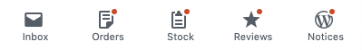
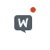
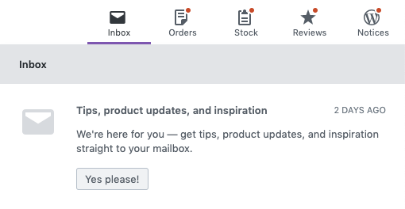
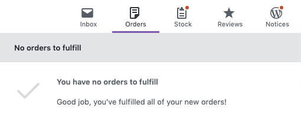
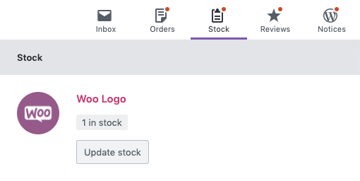
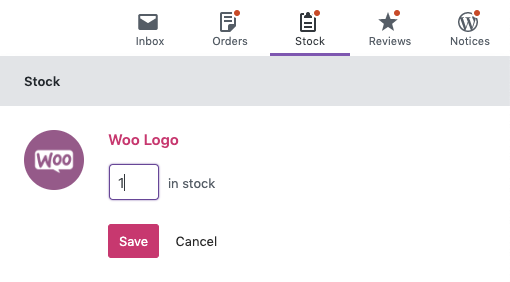
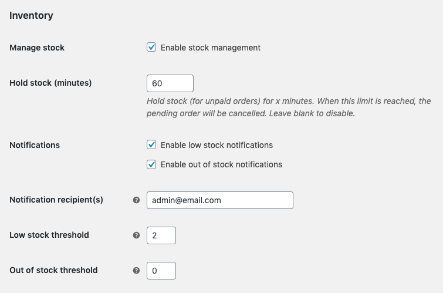
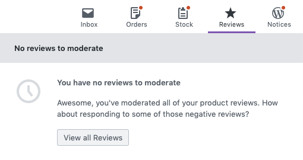

# Activity Panels

The Activity Panel aims to be a "one stop shop" for managing your store - fulfill new orders, manage product inventory, moderate reviews, and get information about running your store.

Activity Panels can be accessed wherever the WooCommerce Admin navigation bar is shown.

There are five panels: Inbox, Orders, Stock, Reviews, and WordPress Notices. You can read more about each panel below.

Each panel has an orange indicator denoting "unread" items.

On mobile devices, all of the panels get collapsed under the Woo logo.

## Inbox Panel

This Inbox Panel is dedicated to informational content coming from multiple sources such as WooCommerce core, Woo.com Subscription management, extensions activity and store achievements. It also displays insightful content that could help with the day to day tasks of managing and optimizing a store.

## Orders Panel

The Orders Panel displays Orders that are considered "actionable". Orders needing fulfillment are shown by default. You can click "begin fulfillment" to go to the Order Details screen.

If no Orders require attention, the panel will reflect that state.

Manage "actionable" order statuses settings at WooCommerce > Analytics > Settings.

## Stock Panel

For stores with Stock Management enabled, the Stock panel will be displayed.

The Stock Panel will show Products that are either Low in Stock or Out of stock.

"Low in Stock" status is determined by a combination of the store setting and individual product settings. Consult the [Managing Products](https://woo.com/document/managing-products/#inventory-tab) documentation to learn more about managing product stock settings.
 

You can manage Product quantity directly from the Stock Panel.

If no Products require attention, the panel will reflect that state.

If you don't see the Stock Panel and expect to, double check your settings at WooCommerce > Settings > Products > Inventory. Ensure that "enable stock management" is checked.

## Reviews Panel

For stores with Product Reviews enabled, the Reviews panel will be displayed.

The Reviews Panel will show reviews that are pending moderation. Click the "manage" button to go to the Review edit screen where you can moderate the review.

The Reviews Panel will reflect when there are no Reviews pending moderation.

If you don't see the Reviews Panel and expect to, double check your settings at WooCommerce > Settings > Products. Ensure that "enable product reviews" is checked.

## WordPress Notices Panel

The WordPress Notices panel collects (and hides) notices from WordPress to reduce visual clutter on the screen. Activating the panel will show the notices. The button will only be displayed if there are notices to view.
