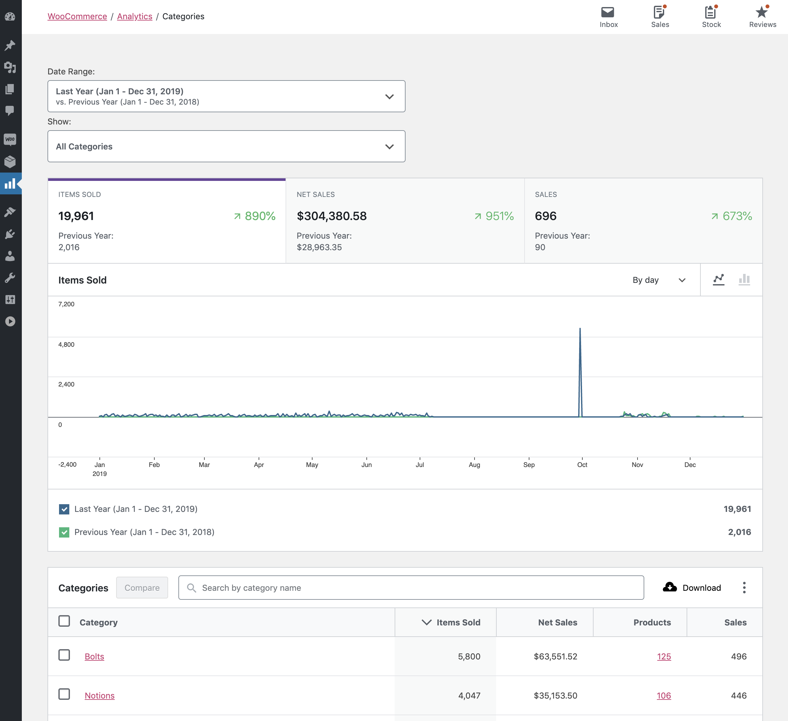
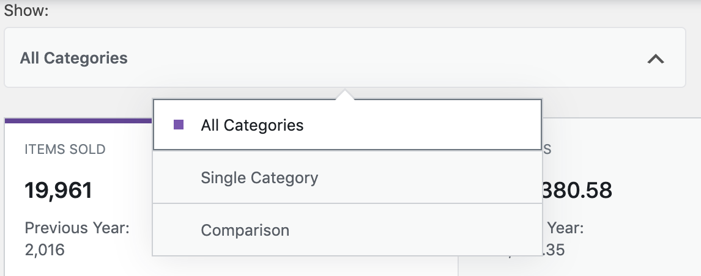
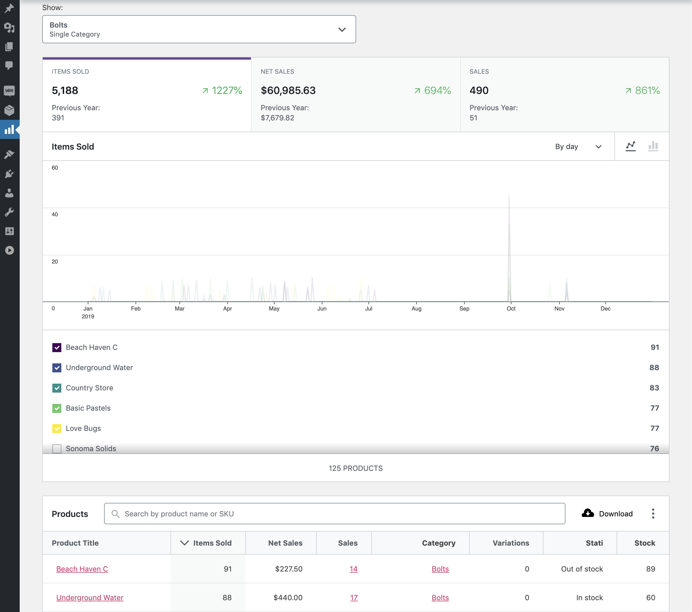
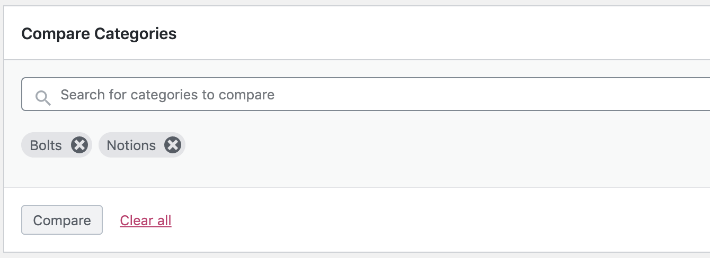
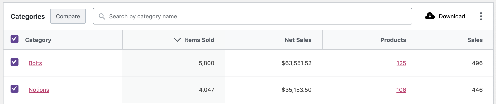
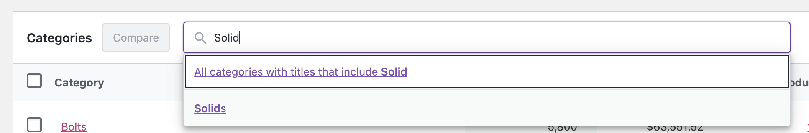

# Categories Report

The Categories Report provides insight about the product categories of your store.

By default, the Categories report is sorted by number of `Items sold` by category descending.

### Report Totals

The total of the rows in the report may not equal the totals at the bottom of the report for two reasons:

- Products can be assigned more than one category. The sales amounts for a product is included in the totals of all assigned categories.
- The sales amounts for children/descendant categories are both shown in the report for that category and included in the totals of the parent category(ies).

### Categories Filters

When the Category report loads it includes all categories for the selected date range. The Category filter dropdown has two filter options:

For either filter, begin typing the name of the category. While you are typing the name of the category the filter will lookup category names that contain the string you have entered. 

#### Single Category

This filter loads the report Categories report listing the products sold within that category.

#### Comparison

This filter loads the report for two or more categories that you have selected.

A second way you can compare categories is using the checkboxes in the table and the `Compare` button at the top of the table.

### Search

At the top of the report table is the search box. This allows you to filter the report by one or more categories.

### Report Sorting

The report table allows sorting by all columns:

- Category
- Items sold
- Net sales
- Products (# of unique products sold)
- Orders (# of orders containing a product in that category)

### Report Links

Two of the Categories report columns contain clickable entries:

- `Category`
- `Products`

Both links opens the Single category report listing the products sold within that category.

Three of the Single category report columns contain clickable entries:

- `Product` link opens the Products report for that product
- `Orders` link opens the Orders report for that product
- `Category` link opens the Single category report for that category

