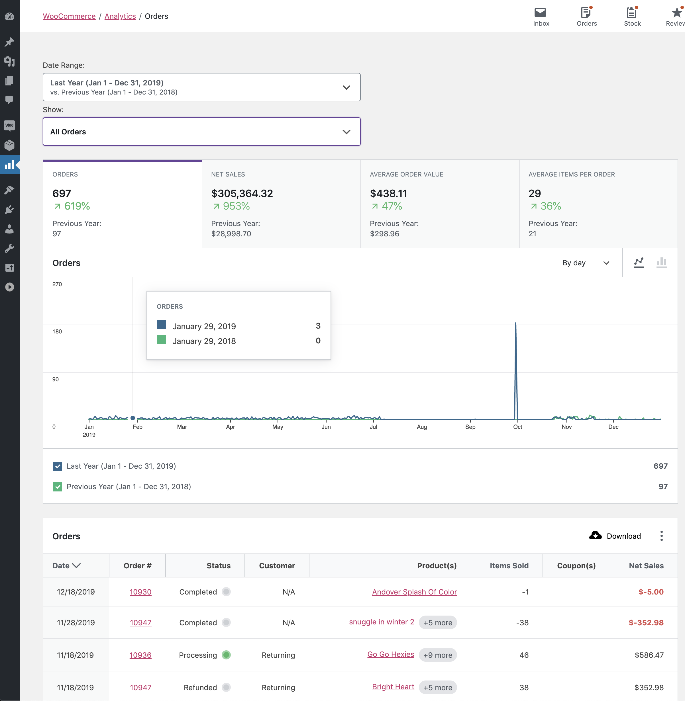

# Orders Report

The Orders Report provides insight about your store's orders.

By default, orders with non-excluded statuses are listed by order date descending. Excluded statuses can be edited on the [Settings page](https://github.com/woocommerce/woocommerce/blob/trunk/plugins/woocommerce-admin/docs/woocommerce.com/analytics-settings.md#excluded-statuses)

Refunded orders cannot be excluded from the orders report. Refunded orders have two rows in the report: one for the date of the original order and one for the date of refund.

### Advanced Filters

The advanced filters allow adding multiple filters to the report. These filters can be applied in two ways:

- All - Orders must match all filters to be included in the report
- Any - Orders must match one or more filters to be included in the report

The following fields can be used for filtering:

- Order Status
- Products
- Coupon Codes
- Customer type
- Refunds
- Tax Rates

### Report Sorting

The report table allows sorting by the following columns:

- Date
- Items sold
- Net sales

By default, the report shows the most recent orders.
