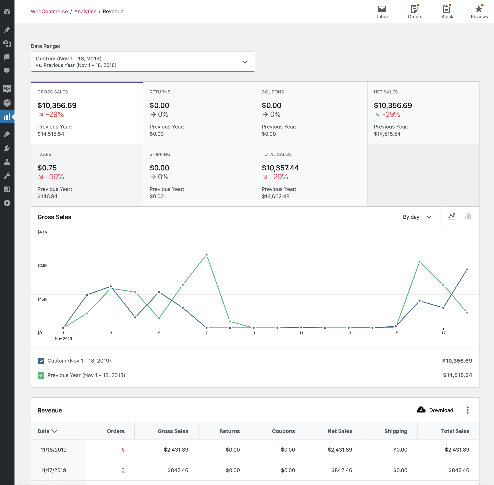

# Revenue Report

The Revenue Report provides insight into the daily revenue of your store. A row is included for each day whether or not there were any orders on that day.

### Report Sorting

The report table allows sorting by the all report columns:

- Date
- Orders (# of orders)
- Gross sales
- Returns (Return amount)
- Coupons (Coupon amount)
- Net sales
- Taxes
- Shipping
- Total sales

By default, the report shows the most recent days.

### Report Links

The Orders column contains clickable entries that take you to the order edit listing filtered to orders on that date.
