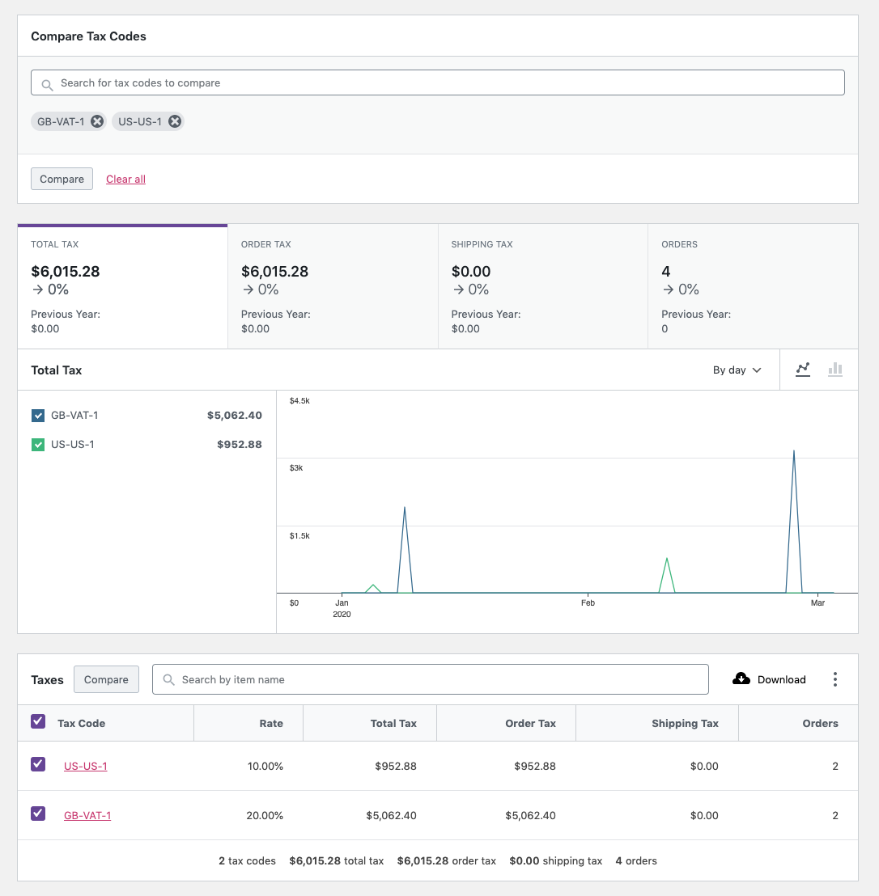

# Taxes Report

The Taxes Report provides insight into taxes collected on your store.

### All Taxes View

By default, the Taxes Report displays the `All taxes` view. All taxes that have been collected in the specified date range will be shown.

### Comparison Mode

By selecting "Comparison", you can search for a multiple tax codes to display report data for.

You can also use the checkboxes in the report table to select tax codes for comparison. Click "Compare" in the table header to compare the selected tax codes.

### Report Search

The search control at the top of the report table provides a quick interface to filter the report to one or more specific tax codes.

It also allows partial string matching on tax codes.

### Report Sorting

The report table allows sorting by the following columns:

- Tax code
- Rate
- Total tax (Order tax + Shipping tax)
- Order tax
- Shipping tax
- Orders (count)

By default, the report is sorted by the creation date of the tax codes.

### Report Links

The `Tax code` column links to the Orders Report, filtered by the selected tax code.
