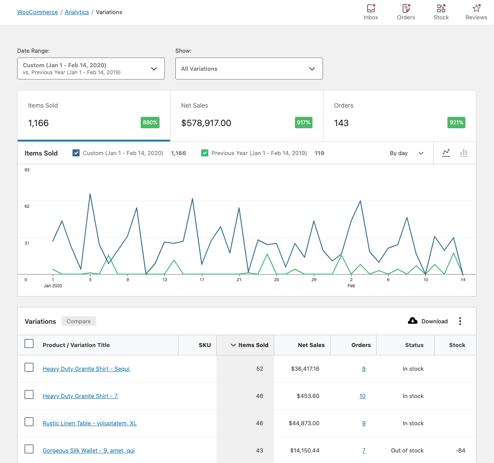
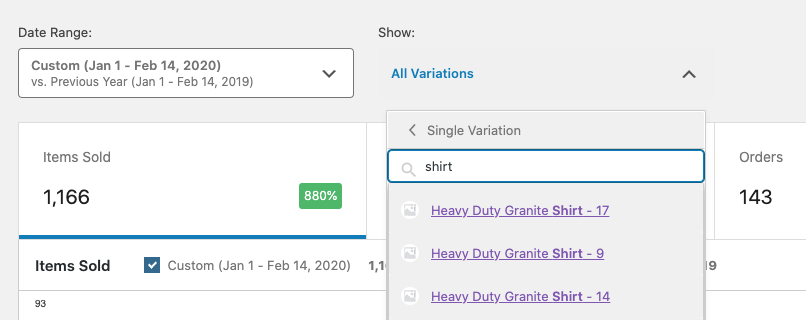
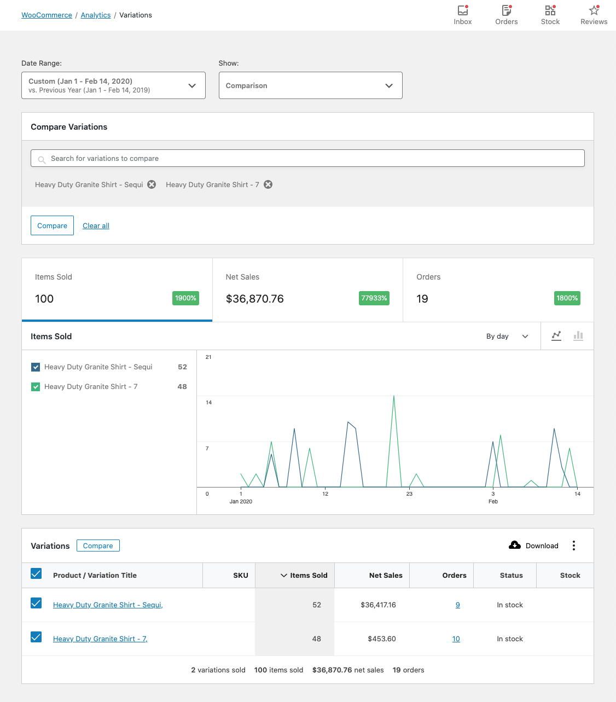
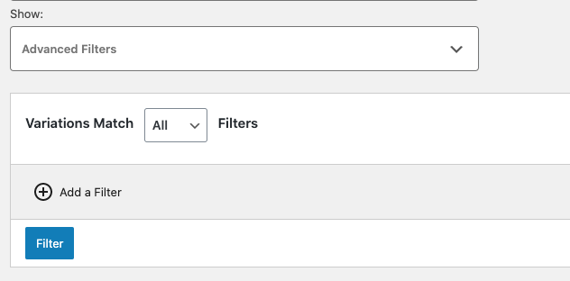

# Variations Report

The Variations Report provides insight into the sales performance of each Product Variation on your store.

### All Variations View

By default, the Variations Report displays the All Variations view. All Variations that have had sales in the specified date range will be shown.

### Single Variation View

By selecting "Single Variation", you can search for a single variation to display report data for.

### Comparison Mode

By selecting "Comparison", you can search for multiple variations to display report data for.

You can also use the checkboxes in the report table to select variations for comparison. Click "Compare" in the table header to compare the selected variations.

### Advanced Filters

The advanced filters allow adding multiple filters to the report. These filters can be applied in two ways:

- All - Variations must match all filters to be included in the report
- Any - Variations must match one or more filters to be included in the report

The following fields can be used for filtering:

- Attribute (can be used multiple times)
- Product (parent product)
- Category

### Report Columns

The report table contains the following columns:

- Variation Title - links to Edit Product screen
- SKU
- Items Sold (count)
- Net Sales
- Orders (count) - links to Orders Report filtered by Variation
- Status (in/out stock)
- Stock (inventory quantity)

### Report Sorting

The report table allows sorting by the following columns:

- SKU
- Items Sold (count)
- Net Sales
- Orders (count)

By default, the report sorts Variations by most items sold.

#### Clarifying Terms

"Net Sales" is calculated by subtracting refunds and coupons from the sale price of the variation(s).

As an equation, it might look like: `(variation price * quantity) - refunds - coupons`.

