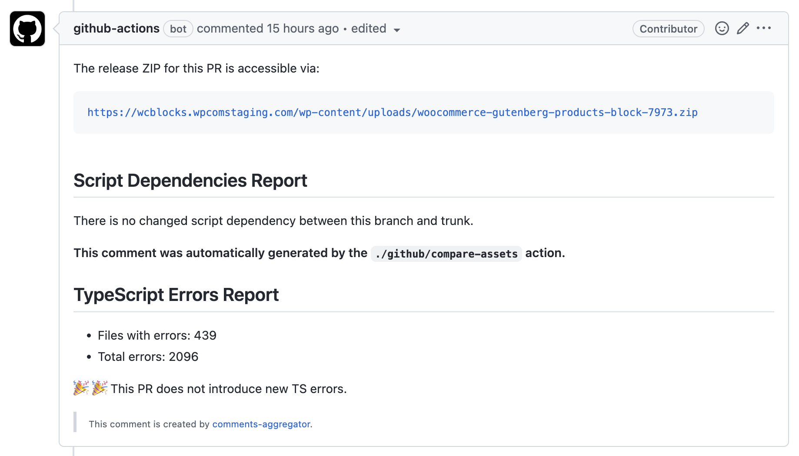

# comments-aggregator

> This GitHub Action helps you keep the PR page clean by merging comments/reports by multiple workflows into a single comment.



## Usage

This action is meant to be used as the poster/commenter. Instead of having existing actions post the comment by themselves, set those comments as the action output, then feed that output to `comments-aggregator` to let this action manage those comments for you.

```yml
      - name: Compare Assets
        uses: ./.github/compare-assets
        id: compare-assets
        with:
          repo-token: '${{ secrets.GITHUB_TOKEN }}'
          compare: assets-list/assets.json
          create-comment: false
      - name: Append report
        uses: ./.github/comments-aggregator
        with:
          repo-token: '${{ secrets.GITHUB_TOKEN }}'
          section-id: compare-assets-with-trunk
          content: ${{steps.compare-assets.outputs.comment}}
```

## Inputs

- **`repo-token`** (required): This is the GitHub token. This is required to manipulate PR comments.
- **`section-id`** (required): The unique ID that helps this action to update the correct part of the aggregated comment.
- **`content`** (option): The comment content. Default to empty. If nothing was provided, this action will stop gracefully.
- **`order`** (optional): The order of the comment part inside the aggregated comment. Default to 10.

## More examples

### Message contains GitHub Event properties

```yml
      - name: Add release ZIP URL as comment to the PR
        uses: ./.github/comments-aggregator
        with:
          repo-token: ${{ secrets.GITHUB_TOKEN }}
          section-id: release-zip-url
          order: 1
          content: |
            The release ZIP for this PR is accessible via:
            ```
            https://wcblocks.wpcomstaging.com/wp-content/uploads/woocommerce-gutenberg-products-block-${{ github.event.pull_request.number }}.zip
            ```
```
