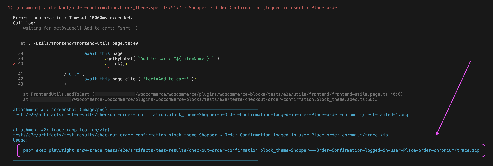
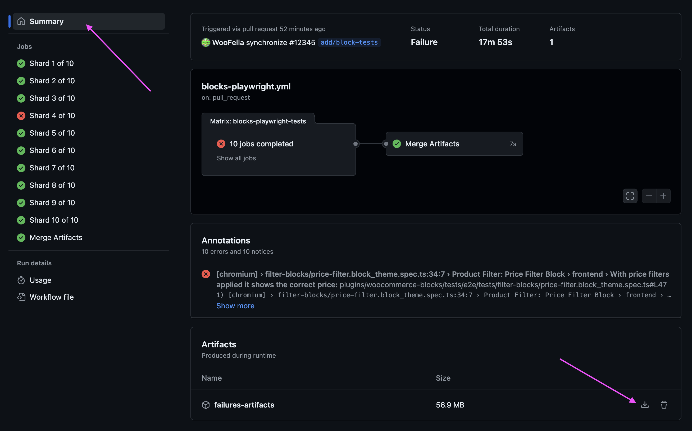
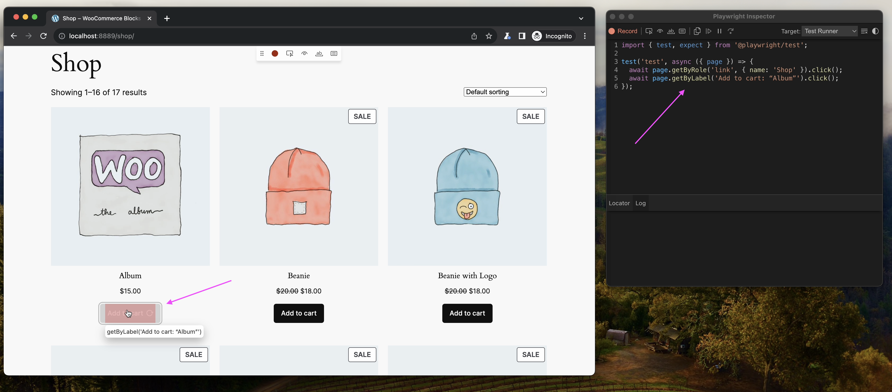

# WooCommerce Blocks End-to-End Tests

This living document serves as a guide for writing end-to-end (E2E) tests with Playwright in the WooCommerce Blocks project.

## Preparing the environment

Please refer to [the Getting Started section of the main `README.md`](https://github.com/woocommerce/woocommerce/blob/trunk/README.md) for a general-purpose guide on getting started. The rest of this document will assume that you've installed all of the prequisites and setup described there.

Run the following command from the repository root to build the WooCommerce plugin:

```sh
pnpm --filter='@woocommerce/plugin-woocommerce' watch:build
```

Next, run the following command from the [`woocommerce-blocks` plugin folder](../../../woocommerce-blocks/) to start a `wp-env` instance and install all the testing products, languages, etc.:

```sh
cd plugins/woocommerce-blocks/
pnpm env:start
```

> [!TIP]
> If you want to start/stop the environment without running the whole setup, use the native `wp-env` commands directly, e.g. `npx wp-env start` and `npx wp-env stop`.

The testing environment should now be ready under [localhost:8889](http://localhost:8889).

### Resetting the environment

Occasionally, you'll need to reset the environment, e.g., when testing products have been updated. To do that, run the following command and go make yourself some coffee:

```sh
pnpm env:restart
```

## Running and debugging tests

> [!NOTE]
> If you're using VSCode, we recommend using the [Playwright Test](https://marketplace.visualstudio.com/items?itemName=ms-playwright.playwright) extension to run and debug the tests.

Here is a basic set of commands to quickly start running and debugging the tests. For full documentation, see the official Playwright guide on [Running and Debugging Tests](https://playwright.dev/docs/running-tests).

```sh
# Run all available tests.
pnpm test:e2e

# Run in headed mode.
pnpm test:e2e --headed

# Run/Debug in UI mode.
pnpm test:e2e --ui

# Run a single test file.
pnpm run test:e2e cart-block.spec.ts

# Run a set of files from a different directories.
pnpm run test:e2e tests/cart/ tests/products/

# Run files that have `cart` or `checkout` in the file name.
pnpm run test:e2e cart checkout

# Run a single test via its line number.
pnpm run test:e2e cart-block.spec.ts:38

# Run/Debug a test with a specific title.
pnpm run test:e2e -g "should display a discount label" --ui
```

> [!TIP]
> When a test fails, it leaves a trace info at the bottom. You can quickly jump into debugging mode by running the generated trace view command, for example:
>
> 

### Debugging tests in CI

When a test fails in CI, a failure artifact is zipped and uploaded to the Summary page of the current job:



Once you download and extract that zip, you'll see dedicated folders for the failed test artifacts. In CI, we retry running a failed test twice before considering it a failure, so there can be up to three folders per failed test. Each of those folders should contain a Playwright trace zip file and a screenshot from the failure moment. On the first retry, we also record the entire test, so the first retry folder should contain a video recording as well. To view a trace, head to the [Playwright Trace Viewer](https://trace.playwright.dev) page and drag and drop the trace zip file there, or run it from the command line:

```sh
npx playwright show-trace <path-to-the-trace>
```

## Writing Tests

We're using the [`@wordpress/e2e-test-utils-playwright`](https://github.com/WordPress/gutenberg/tree/HEAD/packages/e2e-test-utils-playwright) package as our framework base, so we generally follow Gutenberg E2E's [best practices](https://github.com/WordPress/gutenberg/blob/trunk/docs/contributors/code/e2e/README.md#best-practices) to reduce the framework entry threshold and necessary maintenance. However, our framework has specific aspects, which you can learn about in this section.

> [!TIP]
> Using the right selectors can be a daunting task, so let Playwright pick the right selector for you. Open the page you're testing against via `npx playwright open localhost:8889/path-to-the-page`. From there, you can use Playwright Inspector to generate the recommended locators:
>
> 
>
> Read more about generating tests with Playwright in the [Generating Tests](https://playwright.dev/docs/codegen-intro) guide.

### Setup and teardown

We isolate our tests from each other by resetting the database to its initial state **for every test**. Since every test starts with a clean slate, and there's no need to manually reset the environment, we only allow the `beforeEach` hook as there's no point in using `beforeAll`, `afterAll`, or `afterEach`. This approach might seem like a limitation at first, but ultimately it makes tests more stable and easier to write. This convention is enforced by an ESLint rule, so you don't need to worry about it.

### Plugins

To use a custom plugin with your tests, first create the plugin PHP file and save it to the [test plugins folder](../../tests/e2e/plugins/). Here's a handy snippet to help you get started:

```php
// plugins/my-fancy-plugin.php

<?php
/**
 * Plugin Name: WooCommerce Blocks Test My Fancy Plugin
 * Plugin URI: https://github.com/woocommerce/woocommerce
 * Author: WooCommerce
 *
 * @package woocommerce-blocks-test-my-fancy-plugin
 */

function my_fancy_plugin() {
  echo 'Howdy!';
}

add_action('wp_footer', 'my_fancy_plugin');
```

Once the plugin is saved, it will be automatically picked up by `wp-env` - no need to restart the environment. To activate your plugin, use the `RequestUtils.activatePlugin()` API, for example:

```ts
// tests/my-fancy-plugin.spec.ts

import { test, expect } from '@woocommerce/e2e-utils';

test( 'My fancy plugin', async ( { page, requestUtils } ) => {
	await requestUtils.activatePlugin(
		'woocommerce-blocks-test-my-fancy-plugin'
	);

	await page.goto( '/shop' );

	await expect( page.getByText( 'Howdy!' ) ).toBeVisible();
} );
```

> [!IMPORTANT]
> A plugin's slug is created automatically **from the plugin's name**, not from the `@package` statement as you might think. So, if your plugin is named `WooCommerce Blocks Test Bazzinga`, you'll need to activate it by `woocommerce-blocks-test-bazzinga`.

### Themes

Currently, the default theme is Twenty Twenty Four. Activating other themes is done by the `RequestUtils.activateTheme()` API, for example:

```ts
test.beforeEach( async ( { page, requestUtils } ) => {
	await requestUtils.activateTheme( 'storefront' );
} );
```

> [!NOTE]
> Unless it's a one-off thing, remember to use the `beforeEach` hook to activate your theme. Each test starts with a clean database, which means the theme will be reset to the default one as well.

#### Adding a new theme

If you've created a custom theme and want to use it in your tests, save it in the [test themes folder](../../tests/e2e/themes/). Check out the themes that are already there for inspiration. The activation part was explained above, so you're good to go!

### Utilities

We have a handful of [custom utilities](../../tests/e2e/utils/) built on top of core's [`@wordpress/e2e-test-utils-playwright`](https://github.com/WordPress/gutenberg/tree/HEAD/packages/e2e-test-utils-playwright), so make sure to familiarize yourself with them.

#### Creating new utilities

Most of the time, it's better to do a little repetition instead of creating a utility, as over-abstracting can make the code too vague, complicated, or confusing. However, if the piece is complex and repeated enough, we recommend abstracting it into a [POM (Page Object Model)](https://playwright.dev/docs/pom), for example:

```ts
import { test as base, expect, Editor } from '@woocommerce/e2e-utils';

class CartUtils {
	editor: Editor;

	constructor( { editor }: { editor: Editor } ) {
		this.editor = editor;
	}

	async addClothes( list ) {
		// Add clothes from the list.
	}

	async addBooks( list ) {
		// Add books from the list.
	}
}

const test = base.extend< { cartUtils: CartUtils } >( {
	cartUtils: async ( { editor }, use ) => {
		await use( new CartUtils( { editor } ) );
	},
} );

test( 'Add products', async ( { admin, cartUtils } ) => {
	await admin.createNewPost();
	await cartUtils.addClotes( [ 'Shirt', 'Cap', 'Pants' ] );
	await cartUtils.addBooks( [ 'Cooking with Woo' ] );

	await page.goto( '/cart' );

	await expect( this.page.getByLabel( 'Shirt' ) ).toBeVisible();
	// etc.
} );
```

#### Extending Core utilities

If you've come up with a utility that you think should be a part of the Core utilities (`Admin`, `Editor`, `RequestUtils`, etc.), go ahead and make a PR in Gutenberg - it's best to move as much as possible upstream. If you think that the utility still fits under, e.g., `Editor` but is Woo-specific, you'll need to write an extension, for example:

```ts
// utils/editor/index.ts

import { Editor as CoreEditor } from '@wordpress/e2e-test-utils-playwright';

export class Editor extends CoreEditor {
	async insertAllWooBlocks() {
		for ( const wooBlock of [ 'all', 'woo', 'blocks' ] ) {
			await this.insertBlock( wooBlock );
		}
	}
}
```

### Content Templates

We have created `RequestUtils.createPostFromFile()` and `RequestUtils.createTemplateFromFile()` utilities that enable creating complex content testing scenarios with Handlebars templates. The template files are kept in the [content-templates](../../tests/e2e/content-templates/) folder, so you can head there for some inspiration.

> [!IMPORTANT]
> The Handlebars template filenames must be prefixed with the entity type. For posts, an example filename would be `post_with-filters.handlebars`, and for templates `template_archive-product_with-filters.handlebars`. Notice that the latter contains the slug of the template (`archive-product`) before the name (`with-filters`), separated with an underscore - it's necessary for the template to be properly loaded and created.

When you have the template ready, we recommend creating a [test fixture](https://playwright.dev/docs/test-fixtures) that will be used to compile and create your template with given data, for example:

```ts
// tests/product-collection.spec.ts

import { test as base, expect, TemplateCompiler } from '@woocommerce/e2e-utils';

const test = base.extend< {
	filteredProductsTemplate: TemplateCompiler;
} >( {
	filteredProductsTemplate: async ( { requestUtils }, use ) => {
		const compiler = await requestUtils.createTemplateFromFile(
			'archive-product_with-filters'
		);
		await use( compiler );
	},
} );

test( 'Renders correct products for $10-$99 price range', async ( {
	page,
	filteredProductsTemplate,
} ) => {
	await filteredProductsTemplate.compile( {
		price: {
			from: '$10',
			to: '$99',
		},
	} );

	await page.goto( '/shop' );

	await expect( page.getByLabel( 'Products' ) ).toHaveText( [
		'Socks',
		'T-Shirt',
	] );
} );

test( 'Renders correct products for $100-$999 price range', async ( {
	page,
	filteredProductsTemplate,
} ) => {
	await filteredProductsTemplate.compile( {
		price: {
			from: '$100',
			to: '$990',
		},
	} );

	await page.goto( '/shop' );

	await expect( page.getByLabel( 'Products' ) ).toHaveText( [
		'Rolex',
		'Lambo',
	] );
} );
```
