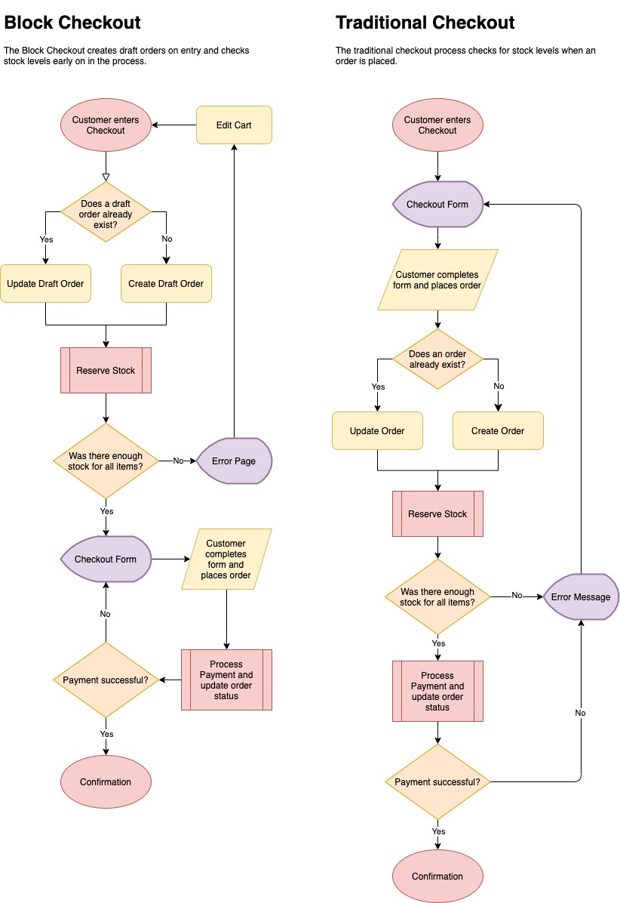

# Stock Reservation during Checkout <!-- omit in toc -->

## Table of contents <!-- omit in toc -->

-   [The Reserved Stock Database Table](#the-reserved-stock-database-table)
    -   [Usage Example](#usage-example)
    -   [What about concurrency?](#what-about-concurrency)
-   [The Reserve Stock Process](#the-reserve-stock-process)
    -   [How the queries work](#how-the-queries-work)
-   [How this all fits into Checkout Block vs Traditional Checkout](#how-this-all-fits-into-checkout-block-vs-traditional-checkout)

To prevent multiple customers trying to purchase the same stock when limits are in place, both WooCommerce ([4.3+](https://github.com/woocommerce/woocommerce/pull/26395#pullrequestreview-430633490)) and the Blocks plugin have a stock reservation system which is used during checkout.

## The Reserved Stock Database Table

The table which tracks reserved stock is named `wc_reserved_stock`, and the schema contains the following columns:

| Key              | Type         | Description                         |
| ---------------- | ------------ | ----------------------------------- |
| `order_id`       | `bigint(20)` | ID of the order.                    |
| `product_id`     | `bigint(20)` | ID of the product or variation.     |
| `stock_quantity` | `double`     | The amount of stock reserved.       |
| `timestamp`      | `datetime`   | The timestamp the hold was created. |
| `expires`        | `datetime`   | The timestamp the hold expires.     |

The primary key is a combination of order and product ID to prevent multiple holds being created for the same order if checkout is performed multiple times.

### Usage Example

This example shows how stock would be reserved programmatically for an order using the `ReserveStock` class which acts as an interface between the checkout and the `wc_reserved_stock` table.

```php
$reserve_stock = new ReserveStock();

try {
    // Try to reserve stock for 10 mins, if available.
    $reserve_stock->reserve_stock_for_order( $order_object, 10 );
} catch ( ReserveStockException $e ) {
    // ...handle error
}
```

This either holds stock, or rejects the order if the stock cannot be reserved for whatever reason. Stock is immediately released when defined time passes, or when the order changes to a “paid” status such as processing, on-hold, or complete.

Some things worth noting:

-   Before stock can be reserved, an order must exist.
-   Stock is reserved for a defined period of time before it expires; these expired rows are cleaned up periodically and do not affect queries for stock levels.
-   If an order is changed, stock should be reserved again. The `ReserveStock` class will renew any existing holds and remove any invalid ones for the current order.

### What about concurrency?

To mitigate concurrency issues (where multiple users could attempt to reserve the same stock at the same time, which is a risk on busier stores) the query used to check and reserve stock is performed in a single, atomic operation.

This operation locks the tables so that separate processes do not fight over the same stock. If there were two simultaneous requests for the same stock at the same time, one would succeed, and one would fail.

## The Reserve Stock Process


### How the queries work

On the technical side:

-   The `ReserveStock` class joins the `wc_reserved_stock` table to `wp_posts` using the post/order ID
-   Only non-expired rows are used
-   Only draft/pending order rows are used

Here is an example query getting stock for Product ID 99 and excluding order ID 100.

```sql
SELECT COALESCE( SUM( stock_table.`stock_quantity` ), 0 )
FROM wp_wc_reserved_stock stock_table
LEFT JOIN wp_posts posts ON stock_table.`order_id` = posts.ID
WHERE posts.post_status IN ( 'wc-checkout-draft', 'wc-pending' )
AND stock_table.`expires` > NOW()
AND stock_table.`product_id` = 99
AND stock_table.`order_id` != 100
```

When creating holds on product stock, this query is used again, but it also creates locks to prevent stock being assigned to multiple orders if they come in around the same time:

```sql
INSERT INTO wp_wc_reserved_stock ( `order_id`, `product_id`, `stock_quantity`, `timestamp`, `expires` )
SELECT 99, 100, 1, NOW(), ( NOW() + INTERVAL 10 MINUTE ) FROM DUAL
WHERE ( $query_for_stock FOR UPDATE ) - ( $query_for_reserved_stock FOR UPDATE ) >= 1
ON DUPLICATE KEY UPDATE `expires` = VALUES( `expires` )
```

In the above code snippet:

-   `$query_for_stock` is a subquery getting stock level from the post meta table, and `$query_for_reserved_stock` is the query shown prior.
-   The `FOR UPDATE` part locks the selected rows which prevents other requests from changing those values until we’ve inserted the new rows.
-   The `ON DUPLICATE KEY` part updates an existing row if one already exists for that order/item.

## How this all fits into Checkout Block vs Traditional Checkout

The point of which stock is reserved differs between the new Block based checkout and the traditional checkout, the main difference being that the Block based checkout reserves stock on entry so the customer isn't forced to fill out the entire checkout form unnecessarily.



You can see that in both Checkouts, if stock cannot be reserved for all items in the order, either the order is rejected, or the user cannot proceed with checkout.
