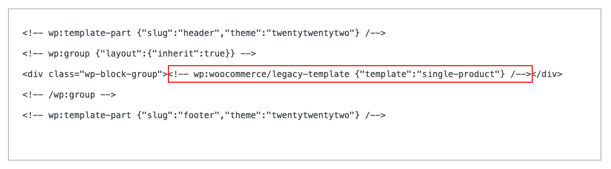

# ClassicTemplate.php <!-- omit in toc -->

The `ClassicTemplate` is a class used to set up the Classic Template block on the server-side, and render the correct template.

## Overview

From this file, we enqueue the front-end scripts necessary to enable dynamic functionality, such as the product gallery, add to basket etc.

From the `render()` method we inspect the `$attributes` object for a `template` property which helps determine which core PHP templating code to execute (e.g. `single-product`) for the front-end views.

<!-- FEEDBACK -->

---

[We're hiring!](https://woocommerce.com/careers/) Come work with us!

🐞 Found a mistake, or have a suggestion? [Leave feedback about this document here.](https://github.com/woocommerce/woocommerce-blocks/issues/new?assignees=&labels=type%3A+documentation&template=--doc-feedback.md&title=Feedback%20on%20./docs/internal-developers/templates/classic-template.md)

<!-- /FEEDBACK -->

