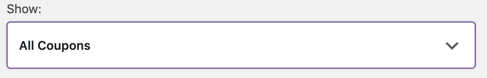
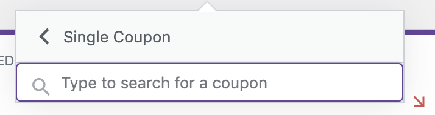
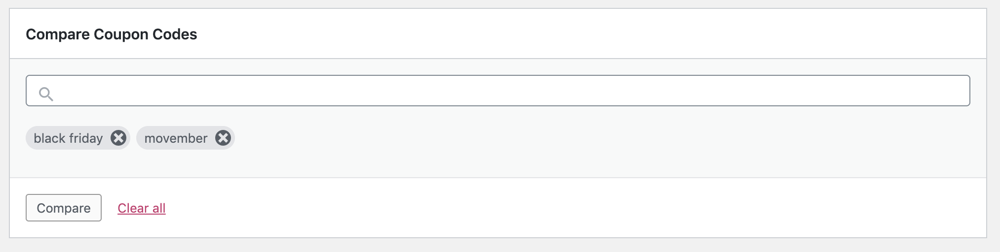

# Coupons Report

WooCommerce 4.0 (and the WooCommerce Admin plugin) includes a new `Analytics` top level menu. The `Coupons` report is under the `Analytics` menu.

If you have a store with existing Orders, you should [Import your Historical Data](analytics-historical-data-import.md)

### Coupon Filters

When the Coupon report loads it includes all coupons for the selected date range. The Coupon filter dropdown has two filter options:

For either filter, begin typing the name of the coupon. While you are typing the name of the coupon the filter will lookup coupon names that contain the string you have entered. 

#### Single Coupon

This filter loads the report for the coupon you have selected.

#### Comparison

This filter loads the report for two or more coupons that you have selected.

### Search

At the top of the report table is the search box. This allows you to filter the report by one or more coupons.

### Report Sorting

The report table allows sorting by the following columns:

- Coupon code
- Orders (Number of orders)
- Amount Dsicounted

### Report Links

Two of the report columns contain clickable entries:

- `Coupon code` link opens the Coupons report for that coupon code
- `Orders` link opens the [Orders Report](analytics-orders-report.md) filtered to orders which used that coupon