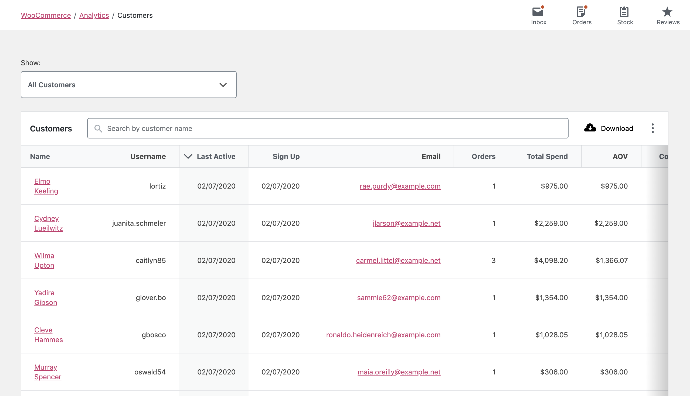
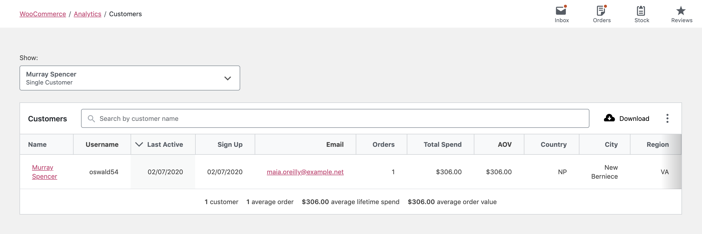
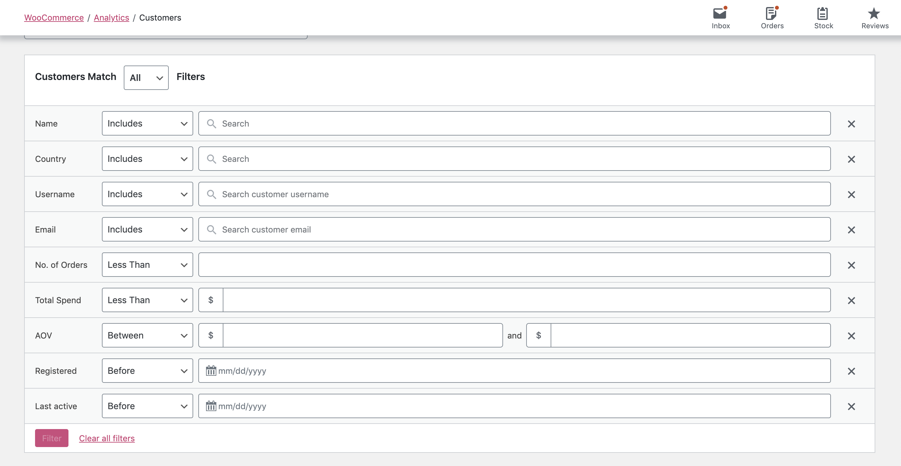
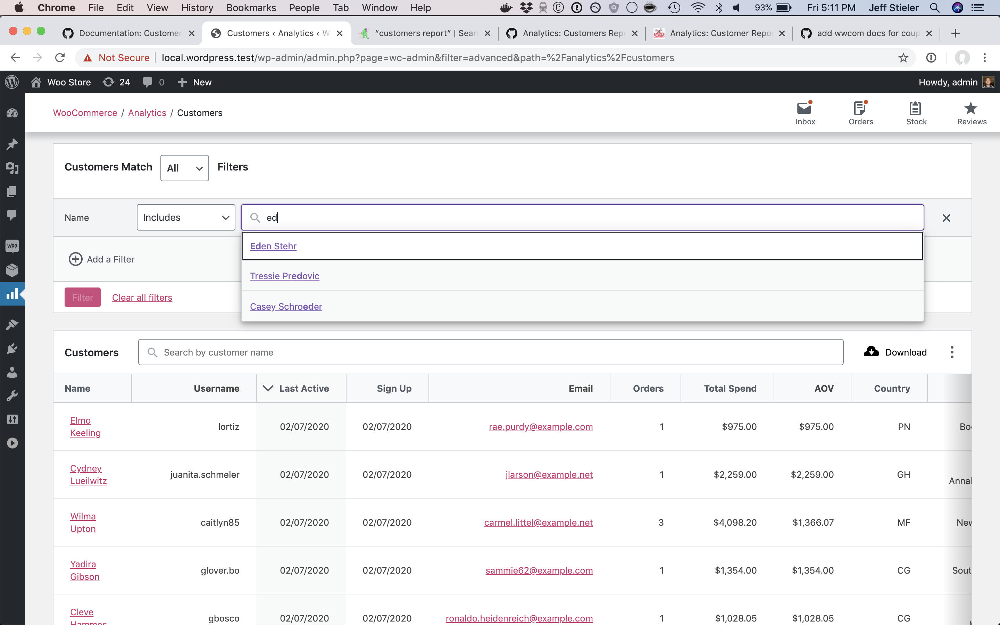
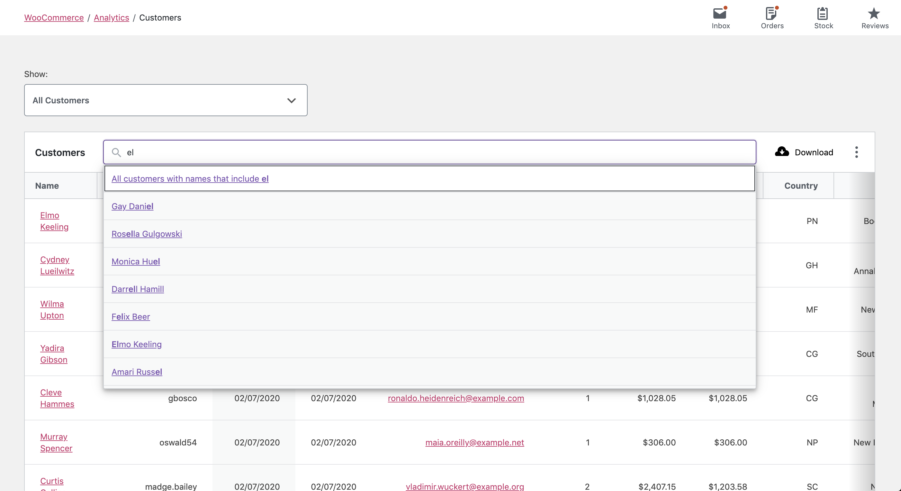
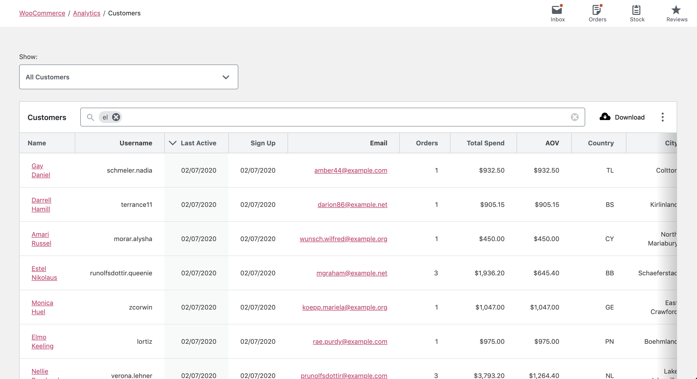

# Customers Report

The Customers Report provides insight about the customers of your store - where they live, when they may have registered, and how they've spent money.

Both registered customers and guests are shown in the report. If a guest checks out using the same email address more than once, their orders will be associated with each other (and they will considered the same purchaser).

### Single Customer View

This option loads the report for the customer you have selected.

### Advanced Filters

There are several filters available to the Customers Report:

- Name
- Country / Region
- Username
- Email
- Orders (count)
- Total Spend
- AOV (Average order value)
- Registered
- Last Active

A special note about the Name, Username, Country / Region, and Email filters:

Unlike the table search, these filters do not allow for a partial match on customers. Instead they provide an easy way to filter the report down to specific names, countries, etc.

### Report Search

The search control at the top of the report table provides a quick interface to filter the report to one or more specific customers, searching by name.

It also allows partial string matching on customer names.

### Report Sorting

The report table allows sorting by the following columns:

- Name
- Last Active
- Sign Up
- Orders
- Total Spend
- Country / Region
- City
- Region
- Postal Code

By default, the report shows the most recently active customers.
