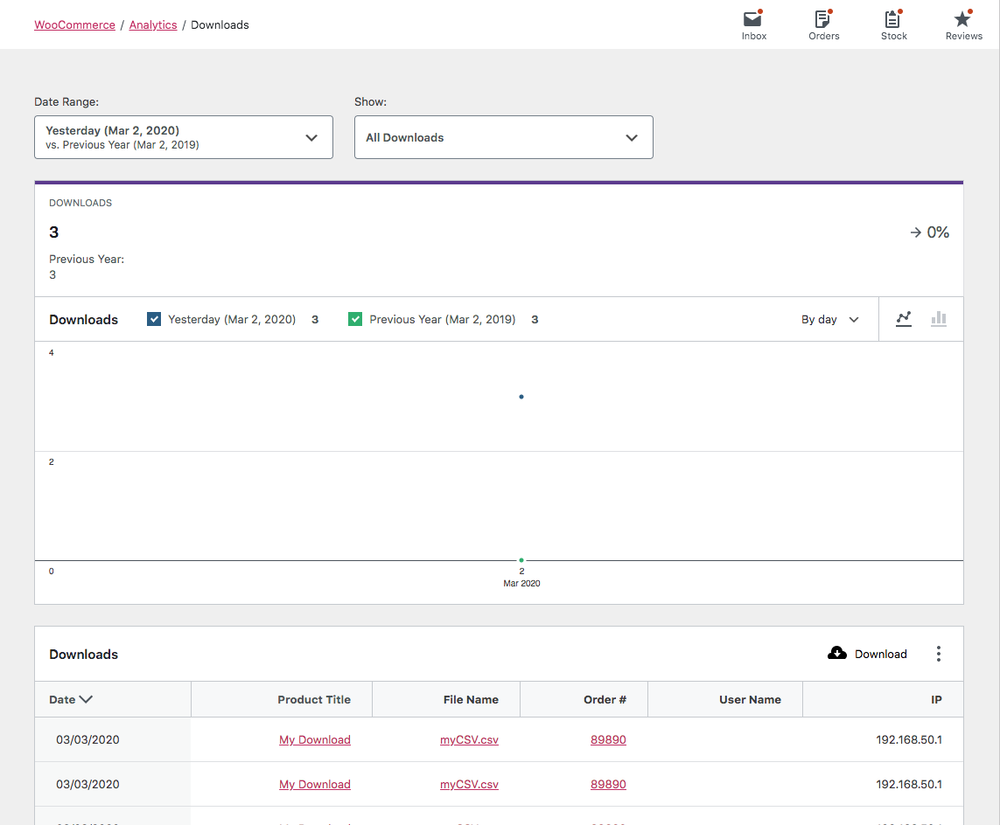
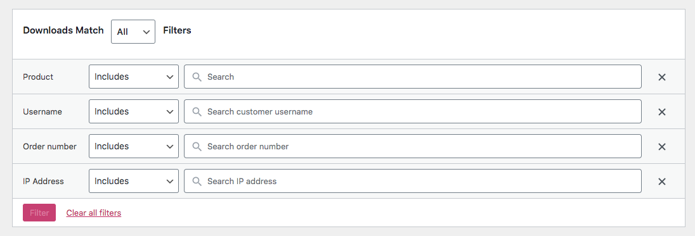

# Downloads Report

The Downloads Report provides insight into the performance of your store's downloadable products. Downloads counts are a total including multiple from the same IP address. Please note that dates are representantive of UTC time as opposed to local timezone as other reports are.

### All Downloads View

By default, the Downloads Report displays the unfiltered `All downloads` View. Each download is represented in the table and chart.

### Advanced Filters

There are several filters available to the Downloads Report:

- Product
- Username
- Order number
- IP Address

### Report Sorting

The report table allows sorting by the following columns:

- Date
- Product title
