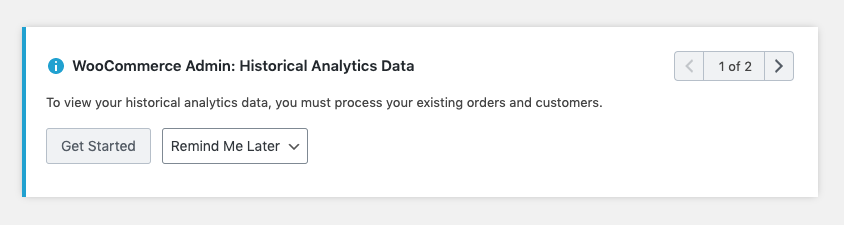
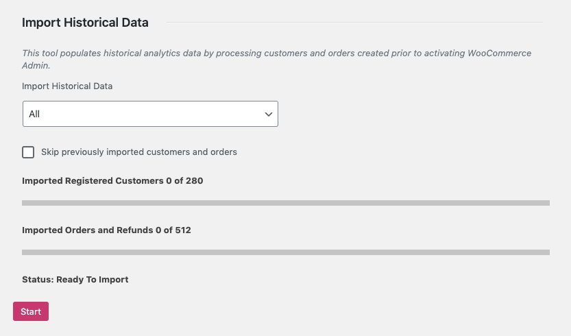
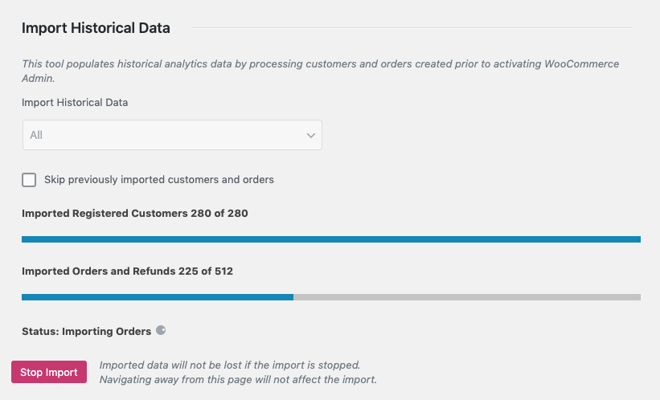
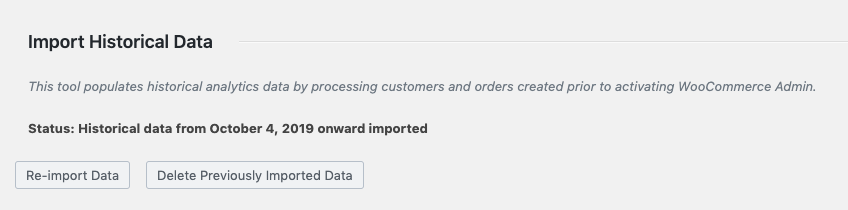

# Importing Historical Data

When you install WooCommerce 4.0 (or the WooCommerce Admin plugin) the new Analytics functionality needs to process the historical data in order to populate new Report pages. This is not done automatically - extremely large or high volume stores might want to schedule a maintenance window in which to import their historical data.

Stores with existing Orders will be prompted to import their data:

### Starting the Import

To start a historical data import, use the prompt above or go to Analytics > Settings, and scroll down to Import historical data.

Stores that only want to see report data from a certain date onward can choose a date period, otherwise "all" data will be imported.

Extremely large or high volume stores might choose to import data in smaller increments - perhaps each year or quarter separately. The "skip previously imported customers and orders" control allows for overlapping date ranges to be imported without unnecessary data processing.

The Customer and Order counts will be updated in real time to reflect changes made to the import settings. Press "start" when you're ready for the import to begin.

### Monitoring Progress

Once you've started an import, progress will be periodically updated on the Analytics > Settings screen.

Navigating away from this page will not affect the import, and you can return to it at any time to monitor progress.

Once the import is complete, the status will reflect it:

You'll be given the option to run another import, or to delete previously imported data. **Please note that deletion is for all analytics data**.

### How the Import Works

#### Initial Data Import

The historical data import uses [Action Scheduler](https://actionscheduler.org/) to queue jobs that process the existing data on your store, building tables of aggregate data to be used in Reports.

Before version 3.0.0, Action Scheduler [used custom post types](https://actionscheduler.org/faq/) to manage queue data. To avoid problems queuing large numbers of items, the import jobs are queued and processed in batches to reduce the likelihood of execution time limits on servers/hosts with limited resources.

#### Subsequent Data Updates

All Customers and Orders that get created after WooCommerce 4.0 (or the WooCommerce Admin plugin) is installed are automatically queued for processing. Only historical data requires manual intevention to process.

#### Action Scheduler at Scale

For extremely large or high volume stores, we recommend following the Action Scheduler documentation for [Background Processing at Scale](https://actionscheduler.org/perf/).

If you're using WooCommerce 3.9 or earlier, the bundled version of Action Scheduler uses a custom post type to manage queues. This can cause performance issues for high volume stores. We recommend installing the [Action Scheduler plugin](https://github.com/woocommerce/action-scheduler/releases) at version 3.0.0 or later. Action Scheduler 3.0.0+ uses custom database tables for queue handling and is significantly faster than previous versions.

