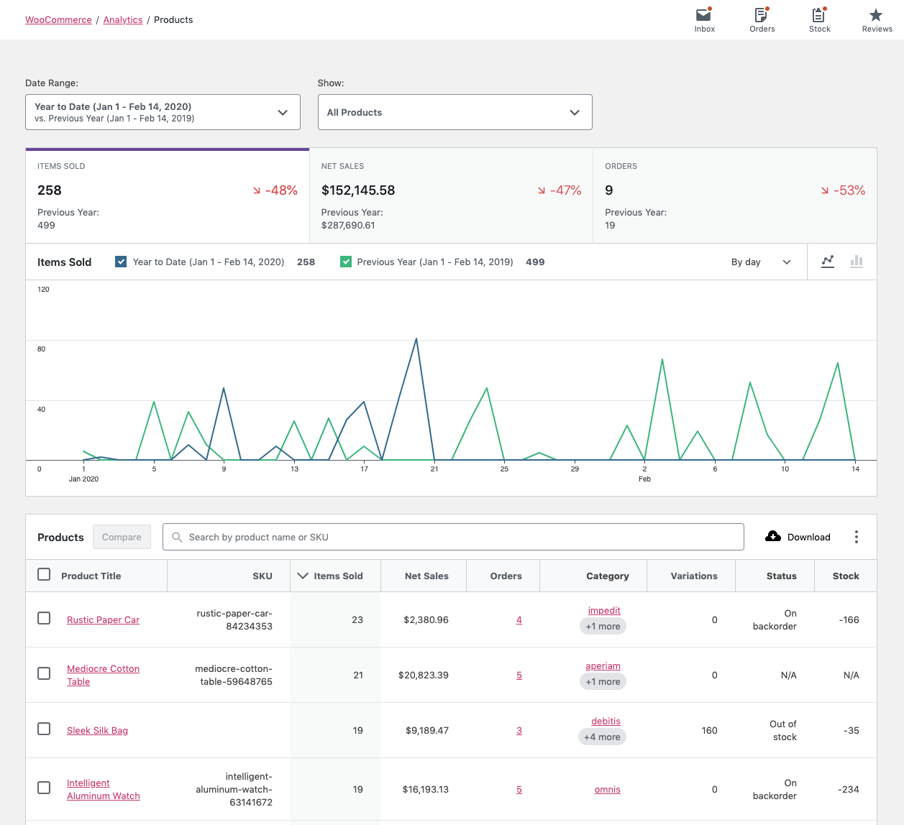
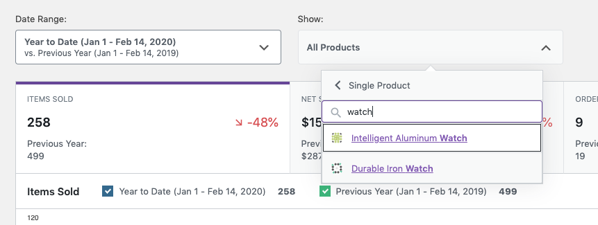
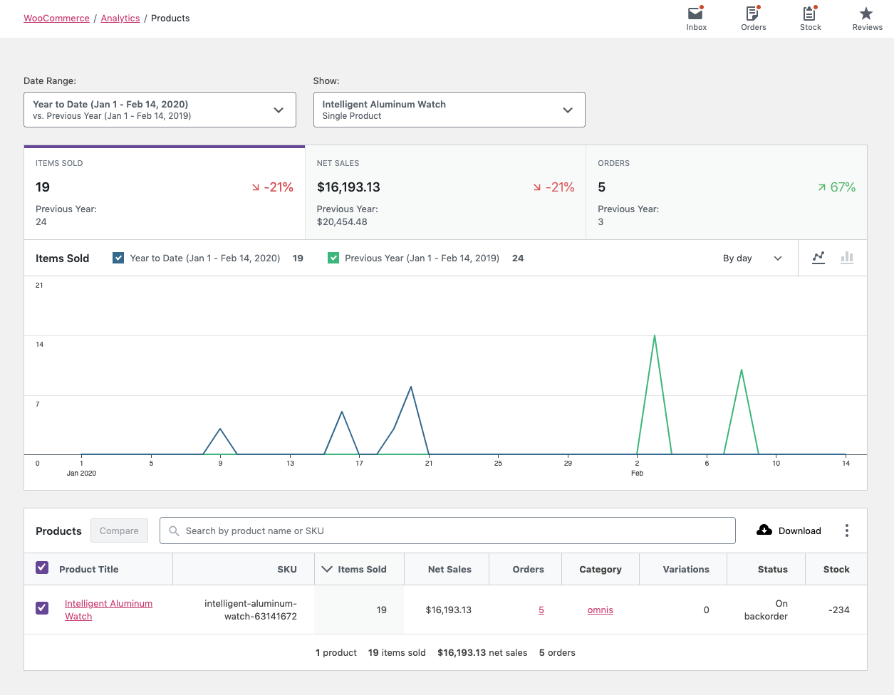
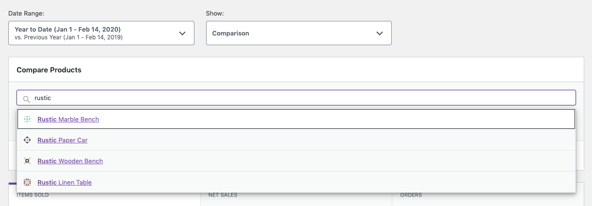
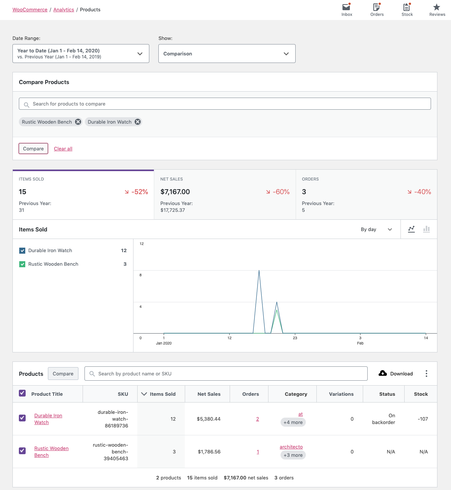
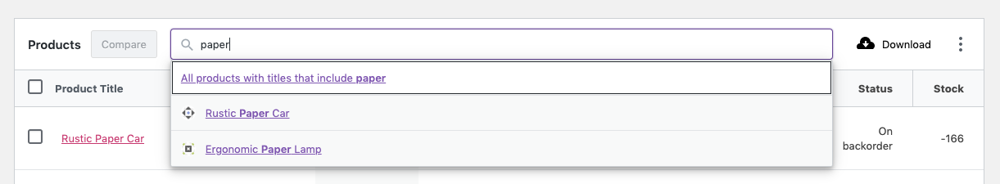
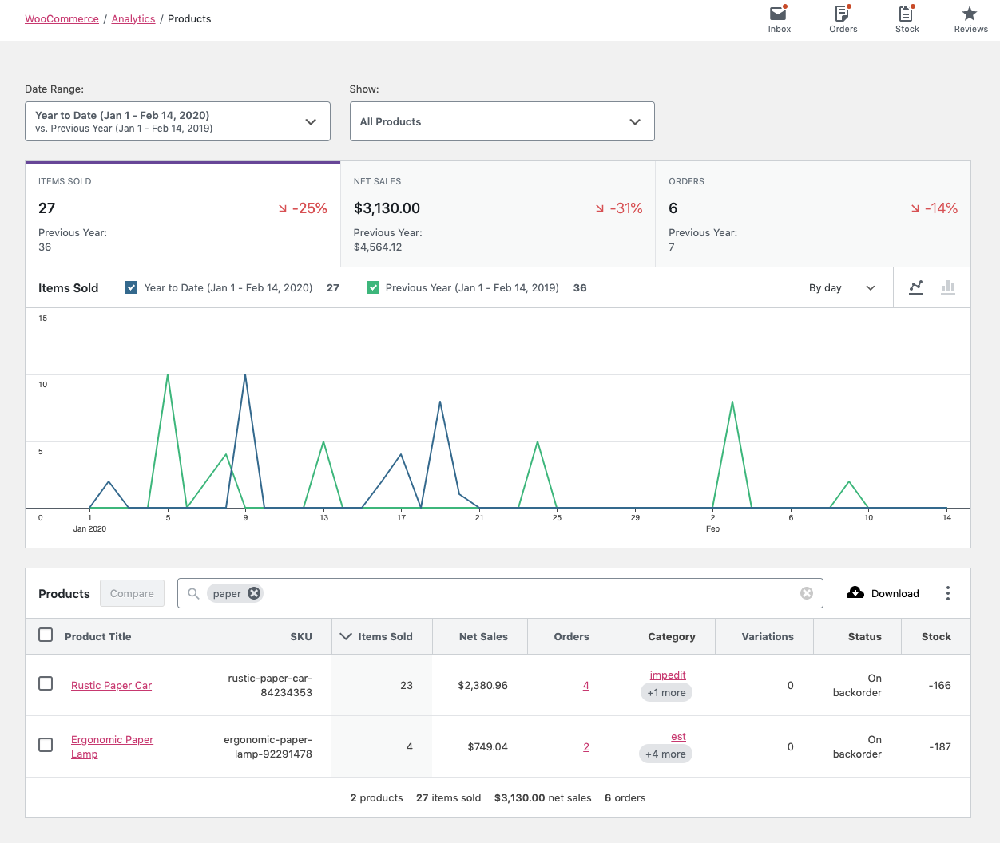

# Products Report

The Products Report provides insight into the sales performance of each product on your store.

### All Products View

By default, the Products Report displays the `All products` view. All products that have had sales in the specified date range will be shown.

### Single Product View

By selecting "Single product", you can search for a single product to display report data for.

### Comparison Mode

By selecting "Comparison", you can search for a multiple products to display report data for.

You can also use the checkboxes in the report table to select products for comparison. Click "Compare" in the table header to compare the selected products.

### Report Search

The search control at the top of the report table provides a quick interface to filter the report to one or more specific products, searching by name.

It also allows partial string matching on product names.

### Report Columns

The report table contains the following columns:

- Product title - links to Single product view
- SKU
- Items sold (count)
- Net sales
- Orders (count) - links to Orders Report filtered by product
- Category - links to Categories Report
- Variations (count)
- Status (in/out stock)
- Stock (inventory quantity)

### Report Sorting

The report table allows sorting by the following columns:

- Product title
- SKU
- Items sold (count)
- Net sales
- Orders (count)
- Variations (count)

By default, the report sorts products by most items sold.

#### Clarifying Terms

"Net sales" is calculated by subtracting refunds and coupons from the sale price of the product(s).

As an equation, it might look like: `(product price * quantity) - refunds - coupons`.

