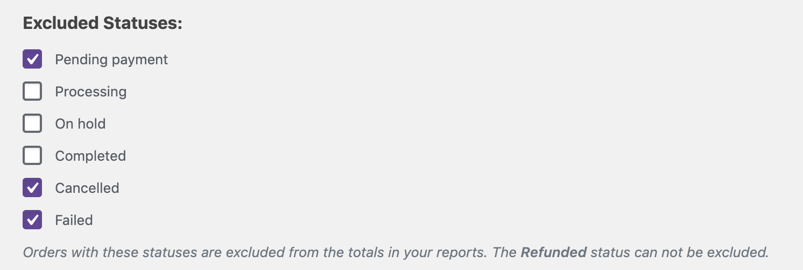
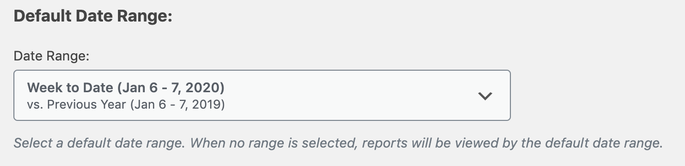

# Analytics Settings

WooCommerce Admin is pre-configured with default settings for WooCommerce Analytics. These settings are broken down into sections:

- Excluded Statuses
- Actionable Statuses - See [Activity Panels](activity-panels.md) for details
- Default Date Range
- Import historical data - See [Importing Historical Data](analytics-historical-data-import.md) for details
- Reset defaults

### Excluded Statuses

In this section, statuses that are **unchecked** are **included** in anayltics reports. **Checked** statuses are **excluded**. If your store uses custom order statuses, those statuses are included in the reports by default. They will be listed in this section under `Custom Statuses` and can be excluded via the status checkbox.

### Default Date Range

WooCommerce Admin is pre-configured with a default date range of `Month to date`. This is the date range that will be used when loading the WooCommerce Dashboard or Analytics page from any non-WooCommerce Admin page. Any reports that support a date range will have a Date Range Picker to allow changing the date range for the report.

### Reset Defaults

The `Reset defaults` button resets the settings to default values for all of the settings above the button. It has no effect on the data imported via `Import historical data`.