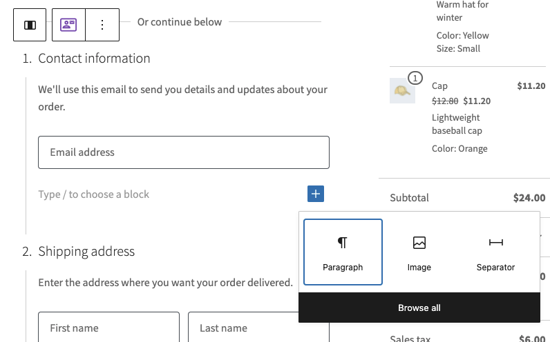

# Blocks Registry <!-- omit in toc -->

## Table of Contents <!-- omit in toc -->

-   [How Inner Blocks Work](#how-inner-blocks-work)
-   [Inner Block Areas](#inner-block-areas)
-   [Registering a Block](#registering-a-block)
    -   [Registering a Forced Block](#registering-a-forced-block)
    -   [Passing attributes to your frontend block](#passing-attributes-to-your-frontend-block)
    -   [Registering a Block Component](#registering-a-block-component)
-   [`registerCheckoutBlock( options )`](#registercheckoutblock-options-)
    -   [Usage](#usage)
    -   [Options](#options)
        -   [`metadata` (object, required)](#metadata-object-required)
        -   [`component` (function, required)](#component-function-required)
-   [`getRegisteredBlocks( blockName )`](#getregisteredblocks-blockname-)
    -   [Usage](#usage-1)
-   [`hasInnerBlocks( blockName )`](#hasinnerblocks-blockname-)
    -   [Usage](#usage-2)

This directory contains the Checkout Blocks Registry. This provides functions to **register new Inner Blocks** that can be inserted automatically, or optionally, within the Mini-Cart, Cart and Checkout blocks in certain areas.

Registered Inner Blocks can either be forced within the layout of the Cart/Checkout Block, or they can just be made available to merchants so they can be inserted manually. Inner Blocks registered in this way can also define a component to render on the frontend in place of the Block.

## How Inner Blocks Work

The Checkout Block has several areas in which inner blocks can be registered and added. Once registered, blocks can be inserted by merchants:



If a block is **forced**, merchants won't see the option to insert the block, they will just see the block inserted by default, and they won't be able to remove it from the layout.

## Inner Block Areas

Blocks can be registered within several different areas or parent blocks. Valid values at time of writing include:

| Parent Block/Area                                | Description                                                   |
| :----------------------------------------------- | :------------------------------------------------------------ |
| `woocommerce/checkout-totals-block`              | The right side of the checkout containing order totals.       |
| `woocommerce/checkout-fields-block`              | The left side of the checkout containing checkout form steps. |
| `woocommerce/checkout-contact-information-block` | Within the contact information form step.                     |
| `woocommerce/checkout-shipping-address-block`    | Within the shipping address form step.                        |
| `woocommerce/checkout-billing-address-block`     | Within the billing address form step.                         |
| `woocommerce/checkout-shipping-methods-block`    | Within the shipping methods form step.                        |
| `woocommerce/checkout-payment-block`             | Within the payment methods form step.                         |

See the [`innerBlockAreas`](https://github.com/woocommerce/woocommerce-blocks/blob/6b9955d2a51bc56b0b029edc521ff98e3403dffc/packages/checkout/blocks-registry/types.ts#L8-L33) typedef for the most up to date list of available areas.

## Registering a Block

Register a checkout block on both the server and the client. Client-side registration alone may make the block work in the editor, but WooCommerce cannot inspect its metadata when rendering the frontend. This can prevent saved attributes and translations from reaching the frontend component.

Define the block in `block.json` to keep the server and client registrations consistent. Include the `parent` property with the areas where the block will be available. For example:

```json
{
	"name": "woocommerce/checkout-actions-block",
	"title": "Actions",
	"description": "Allow customers to place their order.",
	"category": "woocommerce",
	"parent": [ "woocommerce/checkout-fields-block" ]
	// ...snip
}
```

Register the metadata on the server during `init`:

```php
add_action(
	'init',
	function () {
		register_block_type_from_metadata( __DIR__ . '/build/namespace-block-name' );
	}
);
```

Register the same metadata on the client with [`registerBlockType`](https://developer.wordpress.org/block-editor/reference-guides/block-api/block-registration/#registration-on-the-client). The [`@woocommerce/extend-cart-checkout-block`](https://github.com/woocommerce/woocommerce/tree/trunk/packages/js/extend-cart-checkout-block) template demonstrates both registrations.

### Registering a Forced Block

If you want your block to appear within the layout of the Checkout without merchant intervention, you can implement locking as follows:

```json
{
	"name": "woocommerce/checkout-actions-block",
	"title": "Actions",
	"description": "Allow customers to place their order.",
	"category": "woocommerce",
	"parent": [ "woocommerce/checkout-fields-block" ],
	"attributes": {
		"lock": {
			"type": "object",
			"default": {
				"remove": true,
				"move": true
			}
		}
	}
	// ...snip
}
```

In the above example, the inner block would be inserted automatically, and would not be movable or removable by the merchant.

### Passing attributes to your frontend block

For your block to dynamically render on the frontend and have access to its own attributes, both the block name and the list of block attributes need to be passed via HTML `data-` attributes.

-   To render the block on the frontend, you need a `data-block-name` attribute on the HTML with your block name `namespace/block-name`.
-   To access your attributes on frontend, you need to save them as `data-*` attributes on the HTML.

WooCommerce applies these attributes automatically to blocks that:

- use the `woocommerce` or `woocommerce-checkout` namespace; or
- are registered on the server with a WooCommerce block in their `parent` metadata.

Server registration with accurate `parent` metadata is the recommended approach for extension blocks. No filter is needed in that case.

The following experimental filters are compatibility options for blocks that cannot be registered on the server. They should not replace normal server-side block registration.

To opt in an entire namespace, use the `__experimental_woocommerce_blocks_add_data_attributes_to_namespace` filter:

```php
add_filter(
	'__experimental_woocommerce_blocks_add_data_attributes_to_namespace',
	function ( $allowed_namespaces ) {
		$allowed_namespaces[] = 'namespace';
		return $allowed_namespaces;
	},
	10,
	1
);
```

To opt in a single block, use the `__experimental_woocommerce_blocks_add_data_attributes_to_block` filter:

```php
add_filter(
	'__experimental_woocommerce_blocks_add_data_attributes_to_block',
	function ( $allowed_blocks ) {
		$allowed_blocks[] = 'namespace/block-name';
		return $allowed_blocks;
	},
	10,
	1
);
```

### Registering a Block Component

After registering your block, you need to define which component will replace your block on the frontend of the store. To do this, use the `registerCheckoutBlock` function from the checkout blocks registry.

## `registerCheckoutBlock( options )`

This function registers a block and it's corresponding component with WooCommerce. The register function expects a JavaScript object with options specific to the block you are registering.

### Usage

```js
// Aliased import
import { registerCheckoutBlock } from '@woocommerce/blocks-checkout';

// Global import
// const { registerCheckoutBlock } = wc.blocksCheckout;

const options = {
	metadata: {
		name: 'namespace/block-name',
		parent: [ 'woocommerce/checkout-totals-block' ],
	},
	component: () => <div>A Function Component</div>,
};

registerCheckoutBlock( options );
```

### Options

The following options are available:

#### `metadata` (object, required)

This is a your blocks metadata (from `blocks.json`). It needs to define at least a `name` (block name), and `parent` (the areas on checkout) to be valid.

#### `component` (function, required)

This is a React component that should replace the Block on the frontend. It will be fed any attributes from the Block and have access to any public context providers under the Checkout context.

You should provide either a _React Component_ or a `React.lazy()` component if you wish to lazy load for performance reasons.

## `getRegisteredBlocks( blockName )`

Returns an array of registered block objects available within a specific parent block/area.

### Usage

```js
// Aliased import
import { getRegisteredBlocks } from '@woocommerce/blocks-checkout';

// Global import
// const { getRegisteredBlocks } = wc.blocksCheckout;

const registeredBlocks = getRegisteredBlocks(
	'woocommerce/checkout-totals-block'
);
```

## `hasInnerBlocks( blockName )`

Check if a block/area supports inner block registration.

### Usage

```js
// Aliased import
import { hasInnerBlocks } from '@woocommerce/blocks-checkout';

// Global import
// const { hasInnerBlocks } = wc.blocksCheckout;

const isValid = hasInnerBlocks( 'woocommerce/checkout-totals-block' ); // true
```

<!-- FEEDBACK -->

---

[We're hiring!](https://woocommerce.com/careers/) Come work with us!

🐞 Found a mistake, or have a suggestion? [Leave feedback about this document here.](https://github.com/woocommerce/woocommerce/issues/new?assignees=&labels=type%3A+documentation&template=suggestion-for-documentation-improvement-correction.md&title=Feedback%20on%20./packages/public-api/blocks-checkout/blocks-registry/README.md)

<!-- /FEEDBACK -->
